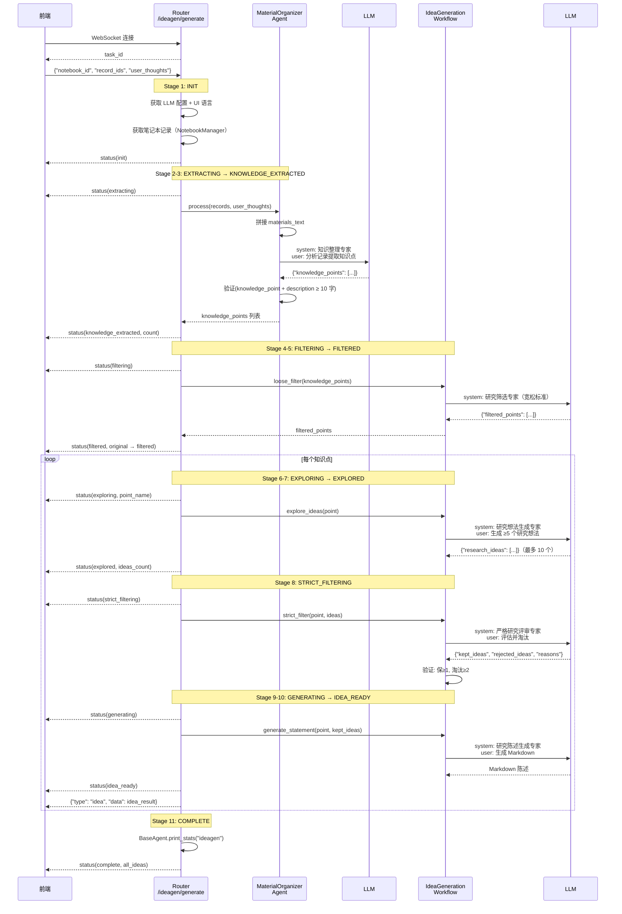

# IdeaGen 素材整理模块源码分析

> 第五阶段学习产出，基于 `src/agents/ideagen/` 源码

---

## 模块概览

IdeaGen 是 DeepTutor 的**研究素材整理**模块，从用户的笔记本记录中提取知识点，并通过多阶段管道生成高质量的研究想法：

| 组件 | 类 | 功能 |
|------|-----|------|
| **MaterialOrganizerAgent** | `material_organizer_agent.py` | 从笔记本记录中提取知识点 |
| **IdeaGenerationWorkflow** | `idea_generation_workflow.py` | 4 步管道编排（过滤→探索→筛选→陈述） |

相比 Question 的 3 Agent + 编排器，IdeaGen 结构更简洁，只有 **1 个 Agent + 1 个 Workflow**。

---

## 架构图

```
前端
    ↓ WebSocket
FastAPI Router (src/api/routers/ideagen.py)
    └── WS /ideagen/generate
          │
          ├── 获取笔记本记录（NotebookManager）
          │
          ├── MaterialOrganizerAgent.process()  → 提取知识点
          │
          └── IdeaGenerationWorkflow
                ├── loose_filter()       → 宽松过滤
                ├── explore_ideas() × N  → 创意探索（≥5 个/知识点）
                ├── strict_filter() × N  → 严格过滤（保≥1、淘汰≥2）
                └── generate_statement() × N → 生成 Markdown 陈述
    ↓
BaseAgent (src/agents/base_agent.py)
    ├── call_llm()    → LLM Factory
    ├── get_prompt()  → PromptManager
    └── _track_tokens() → LLMStats
```

---

## 完整交互流程 — Mermaid 时序图

前端点击「素材整理」时，整个系统的交互过程如下：



### 交互流程要点

1. **两层 LLM 调用**：MaterialOrganizerAgent 用 LLM 提取知识点，IdeaGenerationWorkflow 用 LLM 进行过滤/探索/生成
2. **LLM 调用次数**：处理 N 个知识点需要约 `1(提取) + 1(宽松过滤) + N×3(探索+严格过滤+陈述) = 3N+2` 次 LLM 调用
3. **逐个推送**：每个知识点处理完毕立即推送 `type="idea"` 消息到前端，实现渐进式展示
4. **11 阶段状态流**：init → extracting → knowledge_extracted → filtering → filtered → exploring → explored → strict_filtering → generating → idea_ready → complete

---

## MaterialOrganizerAgent 详解

### 职责

从笔记本记录中提取有研究价值的知识点。

### process() 流程

```
process(records, user_thoughts)
    │
    ├── 遍历 records 提取 {type, title, user_query, output}
    │
    ├── 拼接 materials_text
    │     每条: "=== Record N ===" + Type + Title + User Query + System Response
    │
    ├── 拼接 user_thoughts_text（可选）
    │     "User Additional Thoughts: {user_thoughts}"
    │
    ├── _prompts.get("system")           # 知识整理专家角色
    ├── _prompts.get("user_template")    # {materials_text}{user_thoughts_text}
    ├── call_llm(response_format=json)
    │
    ├── json.loads() → {"knowledge_points": [...]}
    │
    ├── 验证每个知识点:
    │     → 必须有 knowledge_point 和 description 字段
    │     → description 长度 ≥ 10 字符
    │     → 去除空白和无效项
    │
    └── 验证失败 → _fallback_extract()
          → 简化 prompt + 更宽松验证
          → 仍失败 → 兜底返回 "Comprehensive Knowledge Point"
```

### Prompt 角色

**知识整理专家**：
- 从多角度（概念、方法、应用、问题）识别知识点
- 知识点应相对独立、有研究价值
- description 需详细，包含关键信息，≥50 字符
- 输出 JSON：`{"knowledge_points": [{"knowledge_point": str, "description": str}]}`

### 降级策略

process() 有两级降级：
1. **JSON 解析失败** / **验证结果为空** → 调用 `_fallback_extract()` 使用更宽松的 prompt
2. **_fallback_extract() 也失败** → 返回兜底结果（"Comprehensive Knowledge Point"）

---

## IdeaGenerationWorkflow 详解

### 职责

编排 4 步管道，将知识点转化为高质量的研究想法陈述。

### 4 步管道详解

#### Step 1: loose_filter() — 宽松过滤

```
loose_filter(knowledge_points)
    → 拼接 points_text（编号 + 名称 + 描述）
    → LLM: "研究筛选专家"
    → 只筛掉明显不适合的:
        - 过于浅显无研究价值（如 "1+1=2"）
        - 描述完全空白
        - 明显错误或不相关
    → 返回 {"filtered_points": [...]}
    → 降级: 过滤结果为空 → 返回原始列表
    → 降级: JSON 解析失败 → 返回原始列表
```

#### Step 2: explore_ideas() — 创意探索

```
explore_ideas(knowledge_point)
    → LLM: "研究想法生成专家"
    → 从 5 个维度创新思考:
        - 理论深化、方法改进、应用扩展、问题解决、跨学科融合
    → 必须生成 ≥5 个想法（有潜力可生成到 10 个）
    → 返回 {"research_ideas": [...]}
    → 最多返回 10 个（截断）
```

#### Step 3: strict_filter() — 严格过滤

```
strict_filter(knowledge_point, research_ideas)
    → ≤1 个想法 → 直接返回（不过滤）
    → LLM: "严格研究评审专家"
    → 5 维度评估: 研究价值、研究深度、可行性、扩展潜力、具体性
    → 返回 {"kept_ideas", "rejected_ideas", "reasons"}
    → 验证约束:
        - kept_ideas == 0 → 至少保留第一个
        - rejected_ideas < 2（且总数 ≥ 3） → 强制淘汰更多
```

#### Step 4: generate_statement() — 生成陈述

```
generate_statement(knowledge_point, research_ideas)
    → LLM: "研究陈述生成专家"
    → 不要求 JSON 格式，直接输出 Markdown
    → 包含: 知识点回顾 + 每个想法的详细描述 + 保留原因
```

### process() 完整编排

```
process(knowledge_points)
    │
    ├── Step 1: loose_filter(knowledge_points) → filtered_points
    │
    └── for point in filtered_points:
          ├── Step 2: explore_ideas(point)         → research_ideas
          ├── Step 3: strict_filter(point, ideas)  → kept_ideas
          └── Step 4: generate_statement(point, kept_ideas) → statement
    │
    └── 拼接: "# Research Ideas...\n\n" + "---".join(statements)
```

---

## 路由层设计

### WebSocket 端点

| 端点 | 功能 |
|------|------|
| `WS /ideagen/generate` | 执行素材整理 + 研究想法生成 |
| `GET /ideagen/test` | 健康检查 |

### 11 阶段状态流

| 阶段 | stage | 含义 |
|------|-------|------|
| 1 | `init` | 初始化 |
| 2 | `extracting` | 提取知识点 |
| 3 | `knowledge_extracted` | 知识点提取完成 |
| 4 | `filtering` | 宽松过滤 |
| 5 | `filtered` | 过滤完成 |
| 6 | `exploring` | 探索研究想法 |
| 7 | `explored` | 探索完成 |
| 8 | `strict_filtering` | 严格过滤 |
| 9 | `generating` | 生成陈述 |
| 10 | `idea_ready` | 单个想法就绪 |
| 11 | `complete` | 全部完成 |

### 消息类型

| type | 时机 | 说明 |
|------|------|------|
| `task_id` | 连接后 | 返回任务 ID |
| `status` | 各阶段 | `{stage, message, data}` |
| `idea` | 每个知识点完成 | `{knowledge_point, research_ideas, statement}` |

### 两种输入模式

1. **笔记本模式**：提供 `notebook_id`（可选 `record_ids`），从 NotebookManager 加载记录
2. **跨笔记本模式**：直接提供 `records` 列表
3. **纯文本模式**：只提供 `user_thoughts`，生成虚拟知识点

---

## Prompt 文件组织

```
src/agents/ideagen/prompts/
├── en/
│   ├── material_organizer.yaml    # system + user_template + fallback_*
│   └── idea_generation.yaml       # 4 对 system + user_template
└── zh/
    ├── material_organizer.yaml    # 知识整理专家
    └── idea_generation.yaml       # 宽松过滤/创意探索/严格过滤/陈述生成
```

### 模板变量替换

| 组件 | Prompt Key | 变量 |
|------|-----------|------|
| MaterialOrganizerAgent | `user_template` | `materials_text`, `user_thoughts_text` |
| MaterialOrganizerAgent | `fallback_user_template` | `materials_text`, `user_thoughts` |
| IdeaGenerationWorkflow | `loose_filter_user_template` | `points_text` |
| IdeaGenerationWorkflow | `explore_ideas_user_template` | `knowledge_point`, `description` |
| IdeaGenerationWorkflow | `strict_filter_user_template` | `knowledge_point`, `description`, `ideas_text` |
| IdeaGenerationWorkflow | `generate_statement_user_template` | `knowledge_point`, `description`, `ideas_text` |

---

## 2 个组件的对比

| 维度 | MaterialOrganizerAgent | IdeaGenerationWorkflow |
|------|----------------------|----------------------|
| **继承** | BaseAgent | BaseAgent |
| **Prompt 角色** | 知识整理专家 | 4 种角色（筛选/探索/评审/陈述） |
| **LLM 调用次数** | 1-2 次（含降级） | 1 + 3N 次（N=知识点数） |
| **输入** | 笔记本记录列表 | 知识点列表 |
| **输出格式** | JSON（知识点列表） | Markdown（研究陈述） |
| **response_format** | json_object | json_object（前 3 步）/ 无（第 4 步） |
| **降级策略** | _fallback_extract() + 兜底 | 空结果返回原列表 |
| **进度回调** | 无 | 有（progress_callback） |

---

## 与其他模块的对比

| 维度 | ChatAgent (第一阶段) | Co-Writer | Guide | Question | **IdeaGen** |
|------|---------------------|-----------|-------|----------|-------------|
| **Agent 数量** | 1 个 | 2 个 | 4 个 | 3+编排器 | **1+Workflow** |
| **协作模式** | 单 Agent | 无状态流水线 | 有状态流水线 | 三阶段流水线 | **4 步管道** |
| **通信协议** | WebSocket | REST | REST+WS | 纯 WebSocket | **纯 WebSocket** |
| **RAG 依赖** | 核心 | 可选 | 无 | 核心 | **无** |
| **LLM 调用** | 1 次/请求 | 1-3 次 | 1-N 次 | 3-5 次/题 | **3N+2 次** |
| **输出类型** | 文本流 | 编辑文本/音频 | HTML 页面 | JSON+MD | **Markdown** |
| **输入来源** | 用户消息 | 用户文本 | 文档 | 知识库+需求 | **笔记本记录** |

IdeaGen 最显著的特点是**不依赖 RAG**（不做知识库检索），而是直接从用户的笔记本记录中提取信息。

---

## 调试脚本

```
debug_scripts/ideagen/
├── 01_test_material_organizer.py   → MaterialOrganizerAgent（素材文本构造 + LLM 提取 + 验证）
└── 02_test_workflow.py             → IdeaGenerationWorkflow（4 步管道各阶段 + 完整流程）
```
