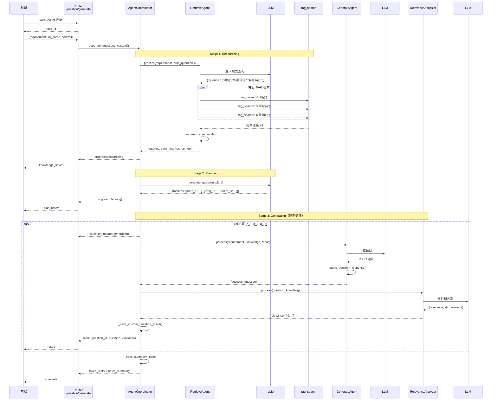
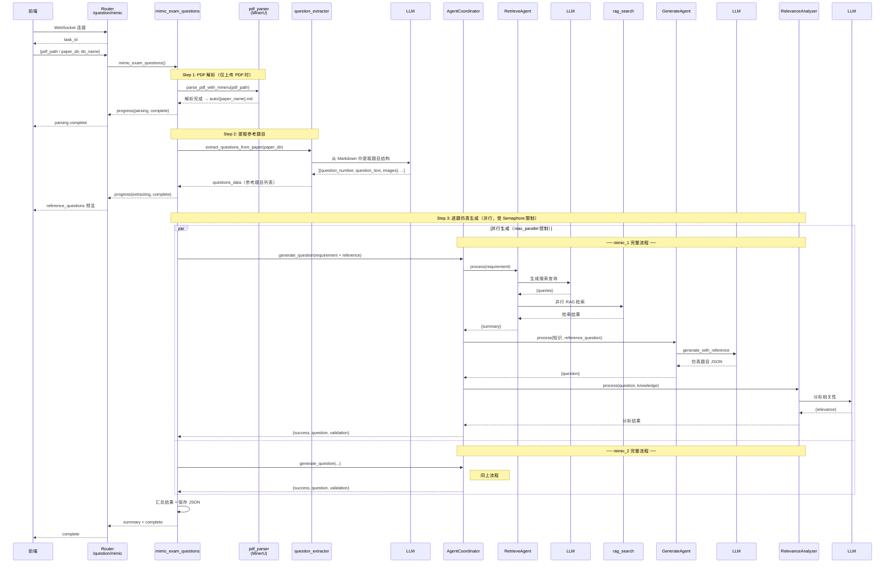

# Question 题目生成模块源码分析

> 第四阶段学习产出，基于 `src/agents/question/` 源码

---

## 模块概览

Question 是 DeepTutor 的**智能题目生成**模块，提供 3 个 Agent + 1 个编排器 + 3 个工具：

| 组件 | 类 | 功能 |
|------|-----|------|
| **RetrieveAgent** | `agents/retrieve_agent.py` | 生成搜索查询 + 并行 RAG 检索 + 汇总知识 |
| **GenerateAgent** | `agents/generate_agent.py` | 根据需求/知识/参考生成题目（Custom + Mimic） |
| **RelevanceAnalyzer** | `agents/relevance_analyzer.py` | 分析题目与知识库的相关性（单次，无拒绝） |
| **AgentCoordinator** | `coordinator.py` | 三阶段流水线编排（Researching → Planning → Generating） |
| **pdf_parser** | `tools/question/pdf_parser.py` | MinerU PDF 解析 |
| **question_extractor** | `tools/question/question_extractor.py` | 从试卷中提取参考题目 |
| **exam_mimic** | `tools/question/exam_mimic.py` | 基于参考试卷批量仿真生成 |

支持两种模式：
- **Custom 自定义模式**：用户指定知识点 → 检索 → 规划 → 批量生成
- **Mimic 仿真模式**：上传试卷 PDF → 解析 → 提取参考题 → 逐题仿真

---

## 架构图

```
前端
    ↓ WebSocket
FastAPI Router (src/api/routers/question.py)
    ├── WS /question/generate → 自定义模式
    │     → AgentCoordinator.generate_questions_custom()
    └── WS /question/mimic   → 仿真模式
          → mimic_exam_questions()
          → AgentCoordinator.generate_question()
    ↓
AgentCoordinator (src/agents/question/coordinator.py)
    ├── Stage 1: RetrieveAgent.process()    → RAG 知识检索
    ├── Stage 2: _generate_question_plan()  → LLM 规划 focuses
    └── Stage 3: for focus in focuses:
          ├── GenerateAgent.process()        → 生成题目
          └── RelevanceAnalyzer.process()    → 相关性分析
    ↓
BaseAgent (src/agents/base_agent.py)
    ├── call_llm()   → LLM Factory
    ├── get_prompt()  → PromptManager
    └── _track_tokens() → LLMStats
    ↓
rag_search() (src/tools/rag_tool.py)
    → RAGService → 向量检索 pipeline
```

---

## 两种模式对比

| 维度 | Custom 自定义模式 | Mimic 仿真模式 |
|------|-------------------|----------------|
| **入口** | `generate_questions_custom()` | `mimic_exam_questions()` |
| **输入** | 需求 dict + 题目数量 | PDF 文件 / 已解析目录 |
| **检索** | 统一检索一次 → 共享知识 | 每题独立检索 |
| **Planning** | 有（生成 focuses） | 无（沿用参考题目结构） |
| **参考题** | 无 | 有（从 PDF 提取） |
| **输出** | `batch_YYYYMMDD/` 目录 | `mimic_papers/` 目录 |

---

## Custom 自定义模式 — 完整交互流程

前端点击「自定义生成」时，整个系统的交互过程如下：



### Custom 模式要点

1. **检索只做一次**：Stage 1 统一检索后，知识上下文在后续所有题目间共享
2. **Plan 产生 focuses**：每道题分配独特的考察角度，避免重复
3. **逐题串行**：Stage 3 中每道题按顺序生成，每题经历 `GenerateAgent → RelevanceAnalyzer` 两步
4. **LLM 调用次数**：生成 N 道题需要约 `1(检索查询) + 1(Plan) + N×2(生成+分析) = 2N+2` 次 LLM 调用

---

## Mimic 仿真模式 — 完整交互流程

前端上传试卷 PDF 或选择已解析试卷时，整个系统的交互过程如下：



### Mimic 模式要点

1. **每题独立检索**：与 Custom 不同，每道参考题目都会独立创建 Coordinator，独立执行 RAG 检索。因为每道参考题考察的知识点不同
2. **没有 Plan 阶段**：直接沿用参考题目的结构，无需规划考察角度
3. **并行生成**：使用 `asyncio.Semaphore(max_parallel)` 控制并发数，多道题同时生成
4. **Extra LLM 调用**：提取参考题目时额外调用一次 LLM（question_extractor），所以每题共需约 `4` 次 LLM 调用
5. **PDF 解析为可选步骤**：如果已上传过试卷（paper_dir 方式），跳过 MinerU 解析

---

## RetrieveAgent 详解

### 职责

从知识库中检索与题目需求相关的背景知识。

### process() 流程

```
process(requirement, num_queries=3)
    │
    ├── requirement → JSON 文本
    │
    ├── _generate_queries(requirement_text, num_queries)
    │     → get_prompt("system")           # 知识库检索助手角色
    │     → get_prompt("generate_queries")
    │     → call_llm(response_format=json)
    │     → json.loads() → {"queries": ["知识点1", "知识点2", ...]}
    │     → 降级：查询为空时使用 requirement 文本前 100 字
    │
    ├── _execute_searches(queries)
    │     → asyncio.gather(*[_single_rag_search(q) for q in queries])
    │       → rag_search(query, kb_name, mode, only_need_context=True)
    │     → 过滤空结果
    │
    └── _summarize_retrievals(retrievals)
          → 逐条拼接: "=== Query: xxx ===" + answer
          → 截断 >2000 chars 的单条结果
```

### Prompt 角色

**知识库检索助手**：
- 只生成纯知识点名称（2-5 个词）
- 不生成题目、任务或指令
- 正确示例：`泰勒定理`、`拉格朗日乘数法`
- 错误示例：`应用泰勒定理近似 f(x)=...`（这是题目）

---

## GenerateAgent 详解

### 职责

根据需求 + 知识上下文 + 可选参考题目，生成结构化题目。

### process() 流程

```
process(requirement, knowledge_context, focus=None, reference_question=None)
    │
    ├── reference_question 不为空？
    │     是 → _generate_with_reference()   # Mimic 模式
    │     否 → _generate_custom()            # 自定义模式
    │
    ├── _generate_custom(requirements_str, knowledge, focus_str, knowledge_point)
    │     → get_prompt("system")     # 专业题目生成 Agent
    │     → get_prompt("generate")   # 包含 {requirements}, {focus}, {knowledge}
    │     → call_llm(response_format=json)
    │
    ├── _generate_with_reference(requirements_str, knowledge, reference)
    │     → get_prompt("generate_with_reference")
    │     → 要求：保持知识范围 + 改变场景/数据/符号
    │
    └── _parse_question_response(response)
          → _extract_json_from_markdown()   # 去除 ```json 包裹
          → _clean_json_string()            # 清理控制字符
          → _fix_common_json_issues()       # 修复末尾逗号、三引号等
          → json.loads() → 题目 dict
```

### 输出结构

```python
{
    "question_type": "choice" | "written",
    "question": "题目内容",
    "options": {"A": "...", "B": "...", "C": "...", "D": "..."},  # 仅选择题
    "correct_answer": "正确答案",
    "explanation": "详细解释",
    "knowledge_point": "知识点名称"
}
```

### Prompt 角色（自定义模式）

**专业题目生成 Agent**：
- 基于知识库内容确保准确性
- 选择题必须只有一个正确答案
- 思维链：内部逐步推理，但只输出最终 JSON
- 计算题应有实质性计算

### Prompt 角色（Mimic 模式）

6 项约束确保仿真质量：
1. 保持相同的核心知识和难度
2. 保持完全相同的知识范围
3. **改变**场景/背景
4. **改变**计算过程
5. **改变**具体数据和符号
6. 保持整体结构

---

## RelevanceAnalyzer 详解

### 职责

分析题目与知识库的相关性。**不拒绝任何题目**，只做分类。

### 关键设计

这是与旧版 `ValidationWorkflow` 最大的区别：

| 维度 | 旧版 ValidationWorkflow | 新版 RelevanceAnalyzer |
|------|------------------------|----------------------|
| 拒绝机制 | 有（reject → 重新生成） | **无**（所有题目接受） |
| 迭代循环 | 有（max_rounds 轮） | **无**（单次分析） |
| 输出 | accept/reject + 修改建议 | high/partial + 覆盖分析 |
| temperature | 默认 | **0.3**（低温度确保稳定） |

### process() 流程

```
process(question, knowledge_context)
    │
    ├── json.dumps(question)                # 格式化题目
    ├── 截断知识上下文（>4000 chars）
    │
    ├── get_prompt("system")                # 教育内容分析师
    ├── get_prompt("analyze_relevance")     # 分析模板
    ├── call_llm(response_format=json, temperature=0.3)
    │
    └── _parse_analysis_response()
          → 归一化 relevance（只允许 "high" 或 "partial"）
          → partial 时保留 extension_points
          → high 时 extension_points 置空
```

### 相关性判断标准

| 级别 | 含义 |
|------|------|
| **high** | 题目可以完全使用知识库内容回答，所有概念和方法都在知识库中 |
| **partial** | 与知识库相关，但需要额外知识，知识库作为基础但有扩展 |

---

## AgentCoordinator 详解

### 职责

编排三阶段流水线，管理 Agent 实例创建和结果持久化。

### 三阶段流水线（Custom 模式）

```
generate_questions_custom(requirement, num_questions)
    │
    ├── Stage 1: Researching ─────────────────────────────────
    │   RetrieveAgent.process(requirement, num_queries)
    │   → 生成搜索查询 + 并行 RAG 检索 + 汇总摘要
    │   → _save_knowledge_json(batch_dir, retrieval_result)
    │   → ws: progress(researching), knowledge_saved
    │
    ├── Stage 2: Planning ────────────────────────────────────
    │   _generate_question_plan(requirement, knowledge, n)
    │   → 直接调用 llm_complete()（不经过 BaseAgent）
    │   → 生成 focuses: [{id:"q_1", focus:"考察角度", type:"choice"}, ...]
    │   → _save_plan_json(batch_dir, plan)
    │   → ws: progress(planning), plan_ready
    │
    └── Stage 3: Generating ──────────────────────────────────
        for idx, focus in enumerate(focuses):
          GenerateAgent.process(requirement, knowledge, focus)
          RelevanceAnalyzer.process(question, knowledge)
          _save_custom_question_result(batch_dir, result)
          ws: question_update, result, progress
```

### Plan 生成

Plan 阶段是 Coordinator **直接调用 LLM**（不使用 BaseAgent），角色是「教育内容规划师」：
- 为每道题生成**独特的考察角度**（focus）
- 确保角度不重复、覆盖不同方面
- 降级机制：LLM 失败时生成默认 focuses（`"Aspect N of {topic}"`）

### 单题生成（Mimic 模式入口）

```
generate_question(requirement)
    → RetrieveAgent.process()       # 检索
    → GenerateAgent.process()       # 生成（可带 reference_question）
    → RelevanceAnalyzer.process()   # 分析
    → _save_question_result()       # 持久化
```

没有 Planning 阶段，直接走三步流程。

### Agent 工厂方法

Coordinator 不直接持有 Agent 实例，而是每次调用时通过工厂方法创建：

```python
def _create_retrieve_agent(self) -> RetrieveAgent:
    return RetrieveAgent(kb_name=self.kb_name, rag_mode=self.rag_mode,
                         language=self.language, api_key=self._api_key, ...)

def _create_generate_agent(self) -> GenerateAgent:
    return GenerateAgent(language=self.language, api_key=self._api_key, ...)

def _create_relevance_analyzer(self) -> RelevanceAnalyzer:
    return RelevanceAnalyzer(language=self.language, api_key=self._api_key, ...)
```

---

## 路由层设计要点

### 纯 WebSocket API（无 REST）

与 Guide 模块的 REST + WebSocket 双模式不同，Question 模块**完全使用 WebSocket**：

| 端点 | 功能 | 对应模式 |
|------|------|----------|
| `WS /question/generate` | 自定义批量生成 | Custom |
| `WS /question/mimic` | 仿真试卷生成 | Mimic |

### WebSocket 消息协议

**前端 → 后端**（`/generate`）：
```json
{
    "requirement": {
        "knowledge_point": "JavaScript 闭包",
        "difficulty": "medium",
        "question_type": "choice"
    },
    "kb_name": "js权威指南",
    "count": 3
}
```

**后端 → 前端**（流式推送）：

| 消息类型 | 时机 | 内容 |
|---------|------|------|
| `task_id` | 开始 | 任务 ID |
| `status` | 开始 | `"started"` |
| `progress` | 各阶段 | `{stage, progress}` |
| `knowledge_saved` | Stage 1 完成 | `{queries}` |
| `plan_ready` | Stage 2 完成 | `{plan, focuses}` |
| `question_update` | Stage 3 中 | `{question_id, status}` |
| `result` | 每题完成 | `{question_id, question, validation}` |
| `token_stats` | 全部完成前 | Token 统计 |
| `batch_summary` | 全部完成前 | 批量摘要 |
| `complete` | 结束 | 完成信号 |
| `log` | 全程 | 日志消息（LogInterceptor 拦截） |

### 日志拦截机制

路由层使用 `LogInterceptor` 拦截 Coordinator 的 logger 输出，实时推送到前端：

```
coordinator.logger → LogInterceptor → log_queue → log_pusher → WebSocket
```

Mimic 端点则使用 `StdoutInterceptor` 拦截 `sys.stdout`：

```
print() → StdoutInterceptor → ANSI 清理 → log_queue → WebSocket
```

---

## 数据存储

### Custom 模式输出

```
data/user/question/batch_YYYYMMDD_HHMMSS/
├── knowledge.json       # RAG 查询 + 检索结果
├── plan.json            # 题目规划（focuses 列表）
├── q_1/
│   ├── result.json      # 题目 + 相关性分析（完整 JSON）
│   └── question.md      # 人类可读格式
├── q_2/
│   ├── result.json
│   └── question.md
└── summary.json         # 整体摘要（success/completed/failed）
```

### Mimic 模式输出

```
data/user/question/mimic_papers/{paper_name}/
├── auto/{paper_name}.md                         # MinerU 解析结果
├── {paper_name}_YYYYMMDD_HHMMSS_questions.json  # 提取的参考题目
└── {paper_name}_YYYYMMDD_HHMMSS_generated.json  # 生成的仿真题目
```

---

## 配置

### `config/main.yaml` 中的 question 配置

```yaml
question:
  rag_query_count: 3          # 每次检索生成的查询数
  max_parallel_questions: 1   # 最大并行题目生成数
  rag_mode: naive             # RAG 检索模式（naive/hybrid）
  agents:
    retrieve:
      top_k: 30               # 检索结果数量
    generate:
      max_retries: 2          # LLM 调用重试次数
    relevance_analyzer:
      enabled: true           # 是否启用相关性分析
```

### `config/agents.yaml` 中的 question 参数

```yaml
question:
  temperature: 0.7            # LLM 温度
  max_tokens: 4000            # 最大输出 tokens
```

---

## 3 个 Agent 的对比

| 维度 | RetrieveAgent | GenerateAgent | RelevanceAnalyzer |
|------|--------------|--------------|-------------------|
| **Prompt 角色** | 知识库检索助手 | 专业题目生成 Agent | 教育内容分析师 |
| **Prompt 长度** | ~31 行 | ~78 行 | ~40 行 |
| **输入** | 需求 dict | 需求+知识+focus | 题目+知识 |
| **输出格式** | JSON（queries + summary） | JSON（题目结构） | JSON（relevance 分析） |
| **response_format** | json_object | json_object | json_object |
| **temperature** | 默认(0.7) | 默认(0.7) | **0.3**（低温度） |
| **外部依赖** | rag_search() | 无 | 无 |
| **特殊处理** | 并行 asyncio.gather | JSON 解析三步容错 | relevance 归一化 |

---

## Prompt 文件组织

```
src/agents/question/prompts/
├── en/                                # 英文
│   ├── retrieve_agent.yaml
│   ├── generate_agent.yaml
│   ├── relevance_analyzer.yaml
│   └── coordinator.yaml
└── zh/                                # 中文
    ├── retrieve_agent.yaml            # system + generate_queries
    ├── generate_agent.yaml            # system + generate + generate_with_reference
    ├── relevance_analyzer.yaml        # system + analyze_relevance
    └── coordinator.yaml               # generate_search_queries + check_relevance + 等
```

### 模板变量替换

| 组件 | Prompt Key | 变量 |
|------|-----------|------|
| RetrieveAgent | `generate_queries` | `requirement_text`, `num_queries` |
| GenerateAgent | `generate` | `requirements`, `focus`, `knowledge` |
| GenerateAgent | `generate_with_reference` | `reference_question`, `requirements`, `knowledge` |
| RelevanceAnalyzer | `analyze_relevance` | `question`, `knowledge` |

---

## 与其他模块的对比

| 维度 | ChatAgent (第一阶段) | Co-Writer | Guide | **Question** |
|------|---------------------|-----------|-------|-------------|
| **Agent 数量** | 1 个 | 2 个 | 4 个 | **3 个 + 编排器** |
| **协作模式** | 单 Agent | 无状态流水线 | 有状态流水线 | **三阶段流水线** |
| **通信协议** | WebSocket（流式） | HTTP REST | REST + WS | **纯 WebSocket** |
| **会话管理** | SessionManager | 无 | GuidedSession | **无（批次目录）** |
| **RAG 依赖** | 核心 | 可选 | 无 | **核心（第一阶段）** |
| **LLM 调用** | 1 次/请求 | 1-3 次 | 1-N 次 | **3-5 次/题** |
| **输出类型** | 文本流 | 编辑文本/音频 | HTML 页面 | **结构化 JSON + MD** |
| **迭代机制** | 无 | 无 | 无 | **无（单次生成）** |

---

## 支撑层笔记：LightRAG Pipeline

Question 阶段顺带了解的 RAG Pipeline 层：

### RAG Provider 路由

```
rag_search()
    → RAGService(provider=env.RAG_PROVIDER)
        → provider 可选：
            - raganything  （RAGAnything，支持多模态）
            - lightrag     （LightRAG，知识图谱增强）
            - llamaindex   （LlamaIndex，向量检索）
        → service.search(query, kb_name, mode)
```

### Question 模块的 RAG 使用特点

- 使用 `only_need_context=True` 参数，只获取检索上下文（不做 LLM 问答）
- 默认 `mode="naive"`（纯向量检索），也可配置为 `hybrid`
- 并行执行多条查询（`asyncio.gather`），提高检索效率

---

## 调试脚本

```
debug_scripts/question/
├── 01_test_retrieve_agent.py       → RetrieveAgent（生成查询 + RAG 检索 + 汇总）
├── 02_test_generate_agent.py       → GenerateAgent（自定义 + Mimic + JSON 解析）
├── 03_test_relevance_analyzer.py   → RelevanceAnalyzer（high/partial 对比）
├── 04_test_coordinator.py          → AgentCoordinator（三阶段流水线 + 文件持久化）
└── 05_test_api_endpoint.py         → WebSocket API 端到端（或回退直接调用）
```
