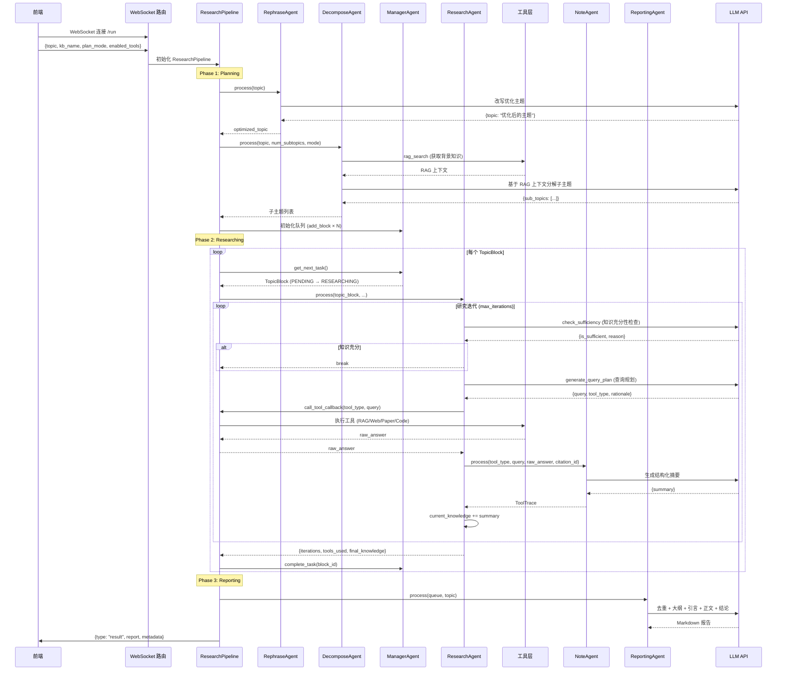
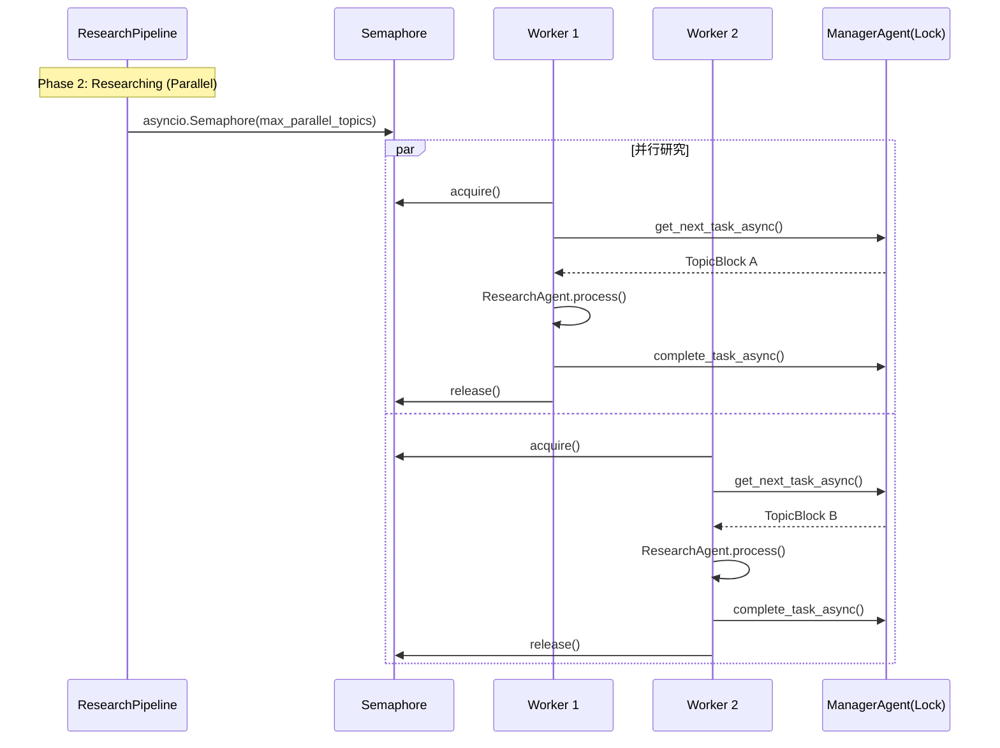

# Research 深度研究模块

> 基于**动态主题队列**架构的多 Agent 深度研究系统，6 个 Agent 在三个阶段协作完成从主题输入到研究报告的全流程。

---

## 模块概览

| Agent          | 阶段        | 职责                                           | 源码                        |
| -------------- | ----------- | ---------------------------------------------- | --------------------------- |
| RephraseAgent  | Planning    | 查询改写（可选，支持多轮交互确认）             | `agents/rephrase_agent.py`  |
| DecomposeAgent | Planning    | 将主题分解为子主题（RAG 增强）                 | `agents/decompose_agent.py` |
| ManagerAgent   | Researching | 队列调度中心，任务分发与状态管理               | `agents/manager_agent.py`   |
| ResearchAgent  | Researching | 执行研究循环：充分性检查 + 查询规划 + 工具选择 | `agents/research_agent.py`  |
| NoteAgent      | Researching | 信息压缩摘要，将工具原始输出转为 ToolTrace     | `agents/note_agent.py`      |
| ReportingAgent | Reporting   | 去重 → 大纲生成 → 逐段撰写 → 引用参考文献      | `agents/reporting_agent.py` |

### 核心数据结构

- **TopicBlock** — 最小调度单元（block_id + sub_topic + status + tool_traces）
- **ToolTrace** — 单次工具调用记录（tool_id + citation_id + query + raw_answer + summary）
- **DynamicTopicQueue** — 动态主题队列（add/get/mark + JSON 持久化）
- **CitationManager** — 引用 ID 管理（Planning: `PLAN-01` / Research: `CIT-3-01`）

---

## 时序交互图

### 前端调用时的完整交互流程（Series 模式）



### Parallel 模式差异



> Parallel 模式使用 `asyncio.Lock` 保护 ManagerAgent 和 CitationManager 的共享状态。

---

## 各 Agent 的 process() 调用链路

### RephraseAgent.process()

```
process(user_input, iteration, previous_result)
  → get_prompt("system", "role")          # 研究策略专家角色
  → get_prompt("process", "rephrase")     # 改写模板
  → call_llm()                             # → {topic}
  → check_user_satisfaction()              # CLI 模式下的交互确认
```

### DecomposeAgent.process()

```
process(topic, num_subtopics, mode="manual|auto")
  ├── manual 模式:
  │   → _generate_sub_queries()            # LLM 生成子查询
  │   → rag_search() × N                  # 每个子查询做 RAG 检索
  │   → _generate_sub_topics()             # 基于 RAG 上下文生成子主题
  └── auto 模式:
      → rag_search(topic)                 # 单次 RAG 检索
      → _generate_sub_topics_auto()        # LLM 自主决定子主题数量
```

### ResearchAgent.process()（核心研究循环）

```
process(topic_block, call_tool_callback, note_agent, citation_manager, ...)
  while iteration < max_iterations:
    ① check_sufficiency(topic, overview, current_knowledge, iteration)
       → LLM → {is_sufficient, covered_dimensions, missing_dimensions}
    ② generate_query_plan(topic, overview, current_knowledge, iteration)
       → LLM → {query, tool_type, rationale, new_sub_topic?}
       → 动态分裂: manager_agent.add_new_topic() （得分≥0.85时）
    ③ call_tool_callback(tool_type, query)    → raw_answer
    ④ citation_manager.get_next_citation_id() → "CIT-块号-序号"
    ⑤ note_agent.process()                    → ToolTrace
    ⑥ topic_block.add_tool_trace(trace)
    ⑦ current_knowledge += trace.summary
```

### NoteAgent.process()

```
process(tool_type, query, raw_answer, citation_id, topic, context)
  → get_prompt("system", "role")           # 信息提取与知识整理专家
  → get_prompt("process", "generate_summary")  # 深度提取框架（4 步）
  → Template.safe_substitute()              # 避免 LaTeX 花括号冲突
  → call_llm()                              # → {summary, key_elements}
  → ToolTrace(tool_id, citation_id, summary, raw_answer)
```

### ReportingAgent.process()

```
process(queue, topic, progress_callback)
  → _deduplicate_blocks()                  # LLM 去重
  → _build_citation_number_map()           # 构建引用编号映射
  → _generate_outline()                    # LLM 生成三级大纲
  → _write_introduction()                  # LLM 写引言
  → _write_section_body() × N             # LLM 写各章节正文
  → _write_conclusion()                    # LLM 写结论
  → _generate_references()                 # 生成参考文献列表
```

---

## 配置体系

配置通过 `config/main.yaml` 的 `research:` 节管理：

| 配置项                       | 默认值 | 说明                                  |
| ---------------------------- | ------ | ------------------------------------- |
| `planning.rephrase.enabled`  | true   | 是否启用主题改写                      |
| `planning.decompose.mode`    | auto   | manual（固定数量）或 auto（LLM 自决） |
| `researching.max_iterations` | 5      | 每个子主题最大研究迭代数              |
| `researching.execution_mode` | series | series（串行）或 parallel（并行）     |
| `researching.enable_*`       | true   | 各工具开关（rag/web/paper/code）      |
| `queue.max_length`           | 5      | 最大子主题数                          |

#### 工具开关说明

| 配置项         | 对应工具                   | 数据来源                               |
| -------------- | -------------------------- | -------------------------------------- |
| `enable_rag`   | `rag_hybrid` / `rag_naive` | 本地知识库（已上传的文档）             |
| `enable_web`   | `web_search`               | 互联网网页                             |
| `enable_paper` | `paper_search`             | 学术论文数据库（如 arXiv、语义学者等） |
| `enable_code`  | `run_code`                 | Python 代码执行环境                    |

> 未启用的工具**不会出现**在发给 LLM 的 Prompt 中，LLM 不会选择它。

#### 三阶段工具引导策略

ResearchAgent 会通过 `_generate_tool_phase_guidance()` 根据已启用工具动态生成分阶段建议：

| 阶段           | 建议工具                                  | 目的                   |
| -------------- | ----------------------------------------- | ---------------------- |
| 阶段 1（早期） | `rag_hybrid` / `rag_naive` / `query_item` | 用知识库构建基础知识   |
| 阶段 2（中期） | + `paper_search` / `web_search`           | 引入外部工具拓展深度   |
| 阶段 3（晚期） | + `run_code`                              | 填补空白、验证、可视化 |

> 若仅开启 RAG 工具，只生成阶段 1 建议并附注「仅 RAG 可用，请多角度探索」，阶段 2/3 不出现。

### 预设模式

| 预设   | 子主题数 | 迭代数 | 模式     | 场景       |
| ------ | -------- | ------ | -------- | ---------- |
| quick  | 1        | 1      | fixed    | 快速概览   |
| medium | 5        | 4      | fixed    | 平衡深度   |
| deep   | 8        | 7      | fixed    | 彻底研究   |
| auto   | ≤8       | ≤6     | flexible | Agent 自决 |

---

## 架构设计分析：从 Workflow 到 Agent

### 项目中两种架构模式的对比

| 维度       | Workflow 模式（CoWriter/Guide/IdeaGen） | Agent 模式（Research）               |
| ---------- | --------------------------------------- | ------------------------------------ |
| 流程控制   | 代码写死 A→B→C 顺序                     | LLM 决定继续/停止                    |
| 工具选择   | 无（或固定调用 RAG）                    | LLM 从工具列表中动态选择             |
| 循环       | 无，数据单向流过                        | 有（while 循环，LLM 决定何时 break） |
| 动态性     | 输入确定则路径确定                      | 同一输入可能走不同路径               |
| 新任务发现 | 无                                      | LLM 可发现新子主题加入队列           |
| 停止条件   | 固定步骤数                              | LLM 判断知识是否充分                 |

> Workflow 模式本质是**带 LLM 的 Pipeline**，LLM 扮演"工人"；Research 模块则让 LLM 拥有**有限但真实的决策权**。

### 三个自主决策点

Research 模块中，LLM 在以下关键节点自主做决定：

| 决策点     | 方法                                | LLM 决定什么                                    |
| ---------- | ----------------------------------- | ----------------------------------------------- |
| 充分性判断 | `check_sufficiency()`               | "当前知识够不够？要不要继续研究？"              |
| 查询规划   | `generate_query_plan()`             | "用哪个工具？查什么内容？查询怎么写？"          |
| 动态分裂   | `new_sub_topic`（查询规划的副产物） | "发现了重要新分支（得分≥0.85），是否加入队列？" |

### Prompt 引导决策的机制

LLM 的决策不是完全自由的，而是通过**动态 Prompt 片段**进行引导：

#### `_generate_tool_phase_guidance()` — 分阶段工具建议

根据配置中**启用了哪些工具**，动态生成三阶段建议（未启用的工具不出现在 Prompt 中）：

| 阶段           | 建议工具                                  | 目的                   |
| -------------- | ----------------------------------------- | ---------------------- |
| 阶段 1（早期） | `rag_hybrid` / `rag_naive` / `query_item` | 用知识库构建基础知识   |
| 阶段 2（中期） | + `paper_search` / `web_search`           | 引入外部工具拓展深度   |
| 阶段 3（晚期） | + `run_code`                              | 填补空白、验证、可视化 |

> 如果只开了 RAG 工具，只会生成阶段 1 + 一句"仅 RAG 可用，请多角度探索"，阶段 2/3 不会出现。

#### `_generate_research_depth_guidance()` — 动态状态感知引导

根据**当前迭代数 + 已用工具列表 + 迭代模式**动态生成，包含三部分：

1. **阶段判定** — 将 `max_iterations` 按 1/3 和 2/3 分成三期：
   - `early_threshold = max(2, max_iterations // 3)`
   - `middle_threshold = max(4, max_iterations * 2 // 3)`

2. **工具多样性提示** — 检查哪些启用的工具还没使用过，中期及之后提醒 LLM 尝试

3. **迭代模式指导**：
   - `fixed`（quick/medium/deep）：强制保守，"早期很少得出充足结论"
   - `flexible`（auto）：给予自主权，"可以提前停止"

#### `string.Template` 变量替换

使用 `$var` 而非 `{var}` 语法，通过 `_convert_to_template_format()` 正则 `re.sub(r"\{(\w+)\}", r"$\1", ...)` 转换。原因：Prompt 中可能含 LaTeX 公式如 `{\rho}`，`str.format()` 会误将其当成变量名而报错，`string.Template` 的 `safe_substitute()` 无此问题且不匹配的变量保持原样。

### 设计约束（护栏）

Research 模块**不是完全自主的 Agent**，有以下硬性约束：

| 约束                  | 说明                                            |
| --------------------- | ----------------------------------------------- |
| 三阶段硬编码          | Planning → Researching → Reporting 顺序不可更改 |
| `max_iterations` 上限 | 无论 LLM 怎么判断，到达上限必须停止             |
| `fixed` 模式          | 强制 LLM 不要过早声明"知识充足"                 |
| 无自我反思            | 不会"我之前的策略错了，换个方向"                |
| 无重试逻辑            | 工具返回低质量结果时不会自动重试                |
| 无多步规划            | 每次只选一个工具，不会规划"先查 A 再查 B"       |

### 设计定位

```
完全编排(Workflow)  ←───────────────────────→  完全自主(Agent)

CoWriter  Guide  IdeaGen      Research              AutoGPT  Manus
   │       │       │              │                    │       │
固定流水线  ────────  框架约束+局部自主决策  ────────  完全自主规划
```

Research 模块采用**框架约束 + 局部自主**的模式，是目前工业界最实用的设计——宏观流程可控，微观决策灵活。完全放飞的 Agent 在稳定性和可预测性上反而不如这种模式。

---

## 调试脚本索引

| 脚本                                                | 测试层  | 是否调 LLM | 说明                               |
| --------------------------------------------------- | ------- | ---------- | ---------------------------------- |
| `debug_scripts/research/01_test_data_structures.py` | Layer 1 | ❌         | 纯数据结构操作                     |
| `debug_scripts/research/02_test_note_agent.py`      | Layer 2 | ✅         | NoteAgent 摘要生成                 |
| `debug_scripts/research/03_test_research_agent.py`  | Layer 3 | ✅         | ResearchAgent 研究循环（模拟工具） |
| `debug_scripts/research/04_test_pipeline.py`        | Layer 4 | ✅         | Pipeline 三阶段端到端              |

运行方式：

```bash
uv run python debug_scripts/research/01_test_data_structures.py
uv run python debug_scripts/research/02_test_note_agent.py
uv run python debug_scripts/research/03_test_research_agent.py
uv run python debug_scripts/research/04_test_pipeline.py
```
