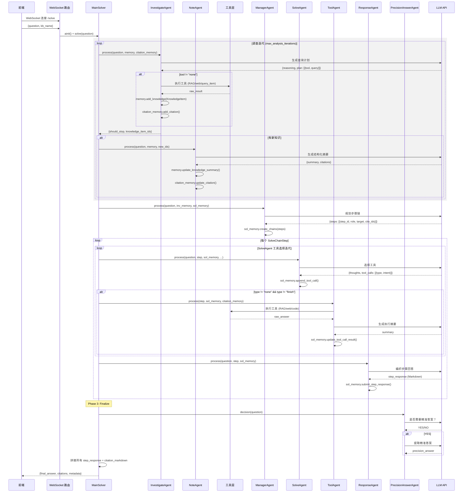

# Solve 问题求解模块

> 基于**双循环架构**（Analysis Loop + Solve Loop）的多 Agent 问题求解系统，7 个 Agent 协作完成从问题分析到精确回答的全流程。

---

## 模块概览

| Agent | 循环 | 角色 | Prompt 角色定位 | 源码 |
|-------|------|------|----------------|------|
| InvestigateAgent | Analysis | 调查员 | 审视问题识别知识缺口，设计查询方案 | `analysis_loop/investigate_agent.py` |
| NoteAgent | Analysis | 知识速记员 | 将原始检索结果整理为结构化摘要 | `analysis_loop/note_agent.py` |
| ManagerAgent | Solve | 战略规划师 | 将问题拆解为逻辑递进的步骤链 | `solve_loop/manager_agent.py` |
| SolveAgent | Solve | 工具策略家 | 为每步选择工具，只做"决策"不做"执行" | `solve_loop/solve_agent.py` |
| ToolAgent | Solve | 实验记录员 | 执行工具调用，记录结果摘要 | `solve_loop/tool_agent.py` |
| ResponseAgent | Solve | 资深助教 | 将素材编织为高质量回答 | `solve_loop/response_agent.py` |
| PrecisionAnswerAgent | Solve | 题型判官+答案提取器 | 判断是否需要精准答案，提取最终结果 | `solve_loop/precision_answer_agent.py` |

### 三种 Memory 系统

| Memory | 管理内容 | 核心数据单元 |
|--------|---------|-------------|
| `InvestigateMemory` | 分析阶段知识链 | `KnowledgeItem`（cite_id + tool_type + query + raw_result + summary） |
| `SolveMemory` | 求解阶段步骤链 | `SolveChainStep`（step_id + step_target + tool_calls + step_response） |
| `CitationMemory` | 全局引用管理 | `CitationItem`（cite_id + tool_type + query + content + stage） |

**cite_id 生成规则**：按工具类型前缀递增，`rag_naive` 和 `rag_hybrid` 共享 `rag` 前缀。
例如：`[rag-1]`、`[rag-2]`、`[code-1]`、`[web-1]`。

### 三种 Memory 的协作关系

`InvestigateMemory` 是 Analysis 阶段的**读书笔记本**（存知识），`SolveMemory` 是 Solve 阶段的**论文草稿**（存步骤），`CitationMemory` 是跨两个阶段的**全局引用登记簿**——不存知识本身，只记录"每条信息从哪来"。

```
┌─ Analysis Loop ──────────────────┐   ┌─ Solve Loop ─────────────────────┐
│                                  │   │                                  │
│  InvestigateAgent → 查 RAG       │   │  SolveAgent → 选工具             │
│       ↓                          │   │       ↓                          │
│  InvestigateMemory               │   │  SolveMemory                     │
│  (存知识: KnowledgeItem)         │   │  (存步骤: SolveChainStep)        │
│       ↓ cite_id                  │   │       ↓ cite_id                  │
│       ↓                          │   │       ↓                          │
└───────┼──────────────────────────┘   └───────┼──────────────────────────┘
        │                                      │
        └──────────────┬───────────────────────┘
                       ↓
              CitationMemory（全局引用登记簿）
              [rag-1] [rag-2] [code-1] [web-1]
                       ↓
              format_citations_markdown()
              → 最终答案的参考文献列表
```

如果没有 CitationMemory，生成参考文献列表时需要同时翻 InvestigateMemory（`KnowledgeItem`）和 SolveMemory（`ToolCallRecord`），数据结构完全不同，拼接困难。有了 CitationMemory，不管哪个阶段的工具调用都统一注册，最终一次 `format_citations_markdown()` 即可输出完整引用。

## 时序交互图

### 前端调用时的完整交互流程



---

## 各 Agent 的 process() 调用链路

### InvestigateAgent.process()（调查员）
```
process(question, memory, citation_memory, kb_name)
  → _build_context(question, memory)           # 已有知识摘要
  → _build_system_prompt()                      # 调查员角色
  → _build_user_prompt(context)                 # 问题 + 已有查询内容
  → call_llm(response_format=json)             # → {reasoning, plan}
  → for plan in tool_plans[:max_actions_per_round]:
      → _execute_single_action(tool, query)    # RAG/web/query_item
      → memory.add_knowledge(KnowledgeItem)
      → citation_memory.add_citation()
  → return {should_stop, knowledge_item_ids, actions}
```

### NoteAgent.process()（知识速记员）
```
process(question, memory, new_knowledge_ids, citation_memory)
  → for cite_id in new_knowledge_ids:
      → get KnowledgeItem from memory
      → _build_context(question, item, memory)
      → _build_user_prompt(context)
      → call_llm()                             # → {summary, citations}
      → memory.update_knowledge_summary(cite_id, summary)
      → citation_memory.update_citation(cite_id, content=summary)
```

### ManagerAgent.process()（战略规划师）
```
process(question, investigate_memory, solve_memory)
  → _build_context(question, investigate_memory)  # 知识链摘要 + 反思
  → call_llm(response_format=json)
  → _parse_response() → List[SolveChainStep]
    # 每步含：step_id, role(计算/推导/分析/画图/整合), target, cite_ids
  → solve_memory.create_chains(steps)
```

### SolveAgent.process()（工具策略家）
```
process(question, current_step, solve_memory, investigate_memory, citation_memory)
  → _build_context()                            # 步骤目标 + 已有引用 + 历史轨迹
  → call_llm(response_format=json)
  → _parse_tool_plan() → [{type, query}]
    # type: code_execution / rag_naive / rag_hybrid / web_search / none / finish
  → for each tool_call:
      → citation_memory.add_citation(stage="solve")
      → solve_memory.append_tool_call()
  → return {requested_calls, finish_requested}
```

### ToolAgent.process()（工具执行器）
```
process(step, solve_memory, citation_memory, kb_name)
  → for record in step.tool_calls (pending):
      → _execute_single_call(record)
        → rag_search() / web_search() / run_code()
      → _summarize_tool_result()               # LLM 生成摘要
      → solve_memory.update_tool_call_result()
      → citation_memory.update_citation()
```

### ResponseAgent.process()（资深助教）
```
process(question, step, solve_memory, investigate_memory, citation_memory)
  → _build_context()                            # 前序内容 + 步骤目标 + 素材
  → call_llm()                                  # 生成 Markdown 回答
  → solve_memory.submit_step_response()
```

### PrecisionAnswerAgent.process()（两阶段）
```
Stage 1: decision(question)                     # "需要精准答案吗？" → YES/NO
Stage 2: extract(question, detailed_answer)     # "提取最终结果" → 精准答案
```

---

## 与 Research 模块的架构对比

| 维度 | Research（深度研究） | Solve（问题求解） |
|------|---------------------|-------------------|
| 目标 | 生成研究报告 | 解答具体问题 |
| 调度单元 | TopicBlock（子主题队列） | SolveChainStep（步骤链） |
| Analysis 阶段 | DecomposeAgent 分解子主题 | InvestigateAgent 识别知识缺口 |
| 执行阶段 | ResearchAgent 循环研究 | SolveAgent 选择工具 + ToolAgent 执行 |
| 输出阶段 | ReportingAgent 三级大纲报告 | ResponseAgent 逐步回答 + PrecisionAnswerAgent |
| 循环层级 | 单循环（每个子主题 while 循环） | 双循环（Analysis + Solve） |
| 工具执行 | Pipeline 直接调用 | ToolAgent 独立封装 |
| Memory | DynamicTopicQueue + ToolTrace | InvestigateMemory + SolveMemory + CitationMemory |

### 设计定位

```
完全编排(Workflow)  ←─────────────────────────→  完全自主(Agent)

CoWriter  Guide  IdeaGen    Solve    Research       AutoGPT  Manus
   │       │       │          │         │              │       │
固定流水线  ────────  双循环+步骤链  ──  框架+局部自主  ──  完全自主
```

Solve 模块的决策自主度：
- **Analysis Loop**：LLM 决定"查什么"和"何时停止"
- **Solve Loop**：LLM 决定步骤数量、角色类型、工具选择，但步骤执行顺序固定串行

---

## 配置体系

配置通过 `config/main.yaml` 的 `solve:` 节管理：

| 配置项 | 默认值 | 说明 |
|--------|--------|------|
| `solve.agents.investigate_agent.max_iterations` | 3 | Analysis Loop 最大迭代次数 |
| `solve.agents.investigate_agent.max_actions_per_round` | 2 | 每轮最多执行的工具调用数 |
| `solve.agents.solve_agent.max_correction_iterations` | 3 | SolveAgent 每步最大迭代次数 |
| `tools.web_search.enabled` | true | 是否启用 web 搜索 |
| `system.language` | zh | 语言（zh/en） |

---

## 调试脚本索引

| 脚本 | 测试层 | 是否调 LLM | 说明 |
|------|--------|-----------|------|
| `debug_scripts/solve/01_test_memory.py` | Layer 1 | ❌ | 三种 Memory 数据结构 |
| `debug_scripts/solve/02_test_investigate_agent.py` | Layer 2 | ✅ | Analysis Loop（InvestigateAgent + NoteAgent） |
| `debug_scripts/solve/03_test_solve_loop.py` | Layer 3 | ✅ | Solve Loop（ManagerAgent + SolveAgent + ToolAgent） |
| `debug_scripts/solve/04_test_pipeline.py` | Layer 4 | ✅ | MainSolver 端到端双循环 |

运行方式：
```bash
uv run python debug_scripts/solve/01_test_memory.py
uv run python debug_scripts/solve/02_test_investigate_agent.py
uv run python debug_scripts/solve/03_test_solve_loop.py
uv run python debug_scripts/solve/04_test_pipeline.py
```
