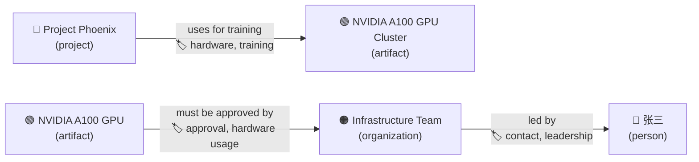
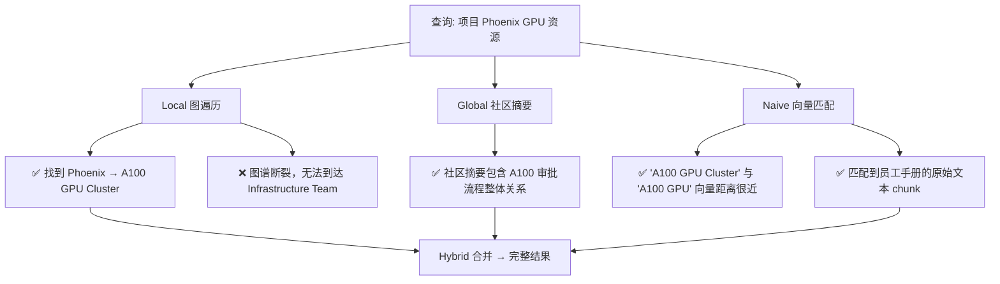
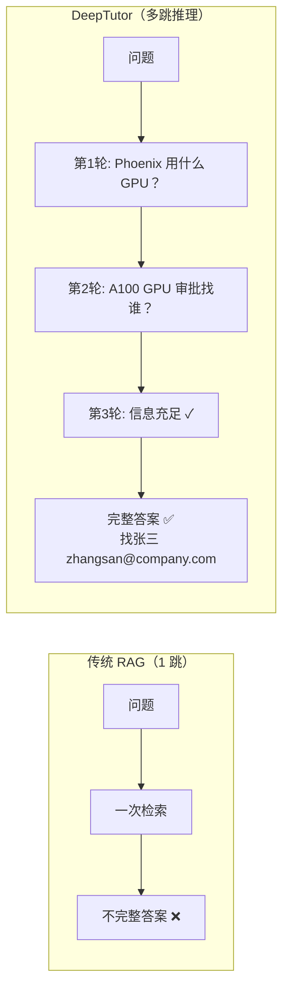
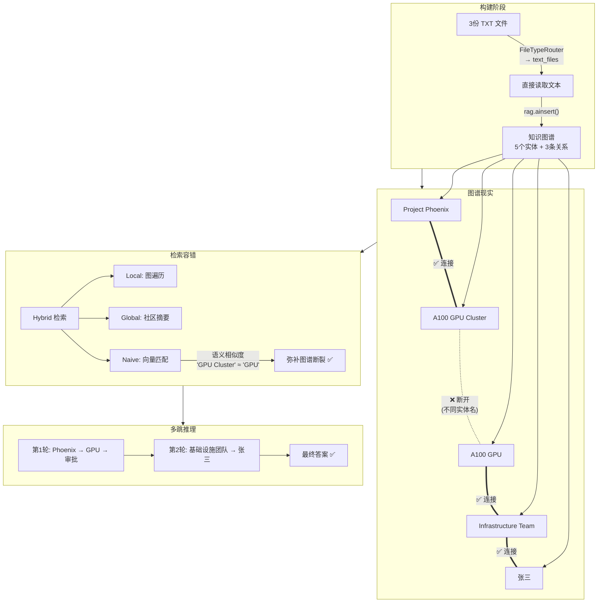

# 具体例子：三份 TXT 文档的 LightRAG 处理与多跳问答全流程

## 场景设定

三份 TXT 文件：

| 文件             | 内容                                                                  |
| ---------------- | --------------------------------------------------------------------- |
| **员工手册.txt** | "所有使用 NVIDIA A100 GPU 的项目，必须由**基础设施团队**审批。"       |
| **项目列表.txt** | "**项目 Phoenix** 使用了 NVIDIA A100 GPU 集群进行大模型训练。"        |
| **组织架构.txt** | "**基础设施团队**的负责人是**张三**，联系邮箱 zhangsan@company.com。" |

**知识库名称：** `company-kb`
**RAG 模式：** `lightrag`
**用户问题：** "项目 Phoenix 的 GPU 资源审批应该找谁？"

---

## 第一部分：上传文件 → 构建知识库

### 完整调用链

```
initialize_rag("company-kb", ["员工手册.txt", "项目列表.txt", "组织架构.txt"], provider="lightrag")
  │
  ├── RAGService.initialize()                    # src/services/rag/service.py
  │     └── factory.get_pipeline("lightrag")     # src/services/rag/factory.py
  │           └── LightRAGPipeline()             # src/services/rag/pipelines/lightrag.py
  │                 配置: PDFParser + LightRAGIndexer + LightRAGRetriever
  │
  └── pipeline.initialize("company-kb", [...])   # src/services/rag/pipeline.py
```

### 步骤 1：文件分类

```python
# src/services/rag/pipeline.py 第 113 行
classification = FileTypeRouter.classify_files(file_paths)
```

`FileTypeRouter` 检查文件扩展名：

- `.txt` → 归入 `text_files` 列表 ✅
- `.pdf` → 归入 `needs_mineru` 列表（不适用本例）

**结果：** 三个文件全部归入 `text_files`，**不走 MinerU 解析（快速路径）**。

### 步骤 2：直接读取文本

```python
# src/services/rag/pipeline.py 第 129-140 行
for path in classification.text_files:
    content = await FileTypeRouter.read_text_file(path)  # 直接 open() 读取
    doc = Document(
        content=content,                # 文件原文
        file_path=str(path),
        metadata={"filename": "员工手册.txt", "parser": "direct_text"}
    )
    documents.append(doc)
```

生成 3 个 `Document` 对象，每个包含一份文件的原文文本。

> **注意：** 因为是 TXT 文件，直接读取原文本，**跳过了 MinerU PDF 解析器**。

### 步骤 3：跳过分块和嵌入

```python
# src/services/rag/pipelines/lightrag.py 第 41 行
# No chunker/embedder - LightRAG does everything internally
```

LightRAG 管线**没有配置 chunker 和 embedder**，因为 LightRAG 内部会自行完成：

- 文本分块
- 实体和关系提取（调用 LLM）
- 向量嵌入

### 步骤 4：LightRAG 构建知识图谱 ⭐ 核心步骤

```python
# src/services/rag/components/indexers/lightrag.py 第 108-112 行
for doc in documents:
    if doc.content:
        await rag.ainsert(doc.content)  # 逐个文档插入
```

对每份文档，`rag.ainsert()` 内部会做：

#### 4a. 文本分块

将文本按 token 数量切分为若干 chunk（对于我们的短文本，每份文件就是一个 chunk）。

从 GraphML 数据可看出三个 chunk 的 ID：

| chunk ID            | 来源文件     |
| ------------------- | ------------ |
| `chunk-3f76c629...` | 项目列表.txt |
| `chunk-fe325e11...` | 员工手册.txt |
| `chunk-231fe50b...` | 组织架构.txt |

#### 4b. LLM 实体和关系提取

LightRAG 调用 LLM 从每个 chunk 中提取 **实体（Entity）** 和 **关系（Relationship）**。

以下是根据真实 GraphML 文件 `graph_chunk_entity_relation.graphml` 的**实际提取结果**：

**项目列表.txt** （chunk-3f76c629）提取出：

| 实体                        | entity_type | 描述                               |
| --------------------------- | ----------- | ---------------------------------- |
| **Project Phoenix**         | project     | 使用 A100 GPU 集群训练大模型的项目 |
| **NVIDIA A100 GPU Cluster** | artifact    | Phoenix 项目使用的 GPU 集群        |

| 关系                                      | 描述           | keywords           |
| ----------------------------------------- | -------------- | ------------------ |
| Project Phoenix → NVIDIA A100 GPU Cluster | 用于训练大模型 | hardware, training |

**员工手册.txt** （chunk-fe325e11）提取出：

| 实体                    | entity_type  | 描述                       |
| ----------------------- | ------------ | -------------------------- |
| **NVIDIA A100 GPU**     | artifact     | 高性能计算硬件             |
| **Infrastructure Team** | organization | 负责审批使用特定硬件的项目 |

| 关系                                  | 描述                                                | keywords                             |
| ------------------------------------- | --------------------------------------------------- | ------------------------------------ |
| NVIDIA A100 GPU → Infrastructure Team | 使用 A100 GPU 的项目必须经 Infrastructure Team 审批 | approval requirement, hardware usage |

**组织架构.txt** （chunk-231fe50b）提取出：

| 实体                    | entity_type  | 描述                               |
| ----------------------- | ------------ | ---------------------------------- |
| **Infrastructure Team** | organization | 基础设施团队（与员工手册合并描述） |
| **张三**                | person       | Infrastructure Team 的负责人       |

| 关系                       | 描述                                 | keywords            |
| -------------------------- | ------------------------------------ | ------------------- |
| Infrastructure Team → 张三 | 张三领导基础设施团队，可通过邮箱联系 | contact, leadership |

#### 4c. 构建知识图谱

所有实体和关系构成一个**图结构**，存储在 `graph_chunk_entity_relation.graphml` 中。

**实际图谱结构（基于真实 GraphML 数据）：**



> ⚠️ **重要发现：实体提取的"不完美"**
>
> 注意看上面的图谱：`Project Phoenix` 连接的是 `NVIDIA A100 GPU Cluster`，而审批规则连接的是 `NVIDIA A100 GPU`。LLM 把原文中的 **"A100 GPU 集群"** 和 **"A100 GPU"** 识别成了**两个不同的实体**！
>
> 图谱中 `Project Phoenix` 和 `Infrastructure Team` **没有直接相连**，中间断开了：
>
> ```
> Project Phoenix → A100 GPU Cluster     (断开)     A100 GPU → Infrastructure Team → 张三
> ```
>
> 这是 LLM 实体提取时常见的现象——同一概念在不同文档中有略微不同的表述（"GPU 集群" vs "GPU"），LLM 没有将它们识别为同一实体。
>
> **但这并不影响最终检索效果。** 接下来我们看为什么。

#### 4d. 社区检测

LightRAG 在图谱上运行社区检测算法，把紧密关联的实体归为"社区"，并为每个社区生成一段摘要。这使得 `global` 模式检索能理解跨文档的宏观关系。

#### 最终存储在磁盘上的文件结构

```
data/knowledge_bases/company-kb/
└── rag_storage/
    ├── kv_store_full_docs.json        # 原始文档存储
    ├── kv_store_text_chunks.json      # 文本分块
    ├── kv_store_llm_response_cache.json  # LLM 缓存
    ├── graph_chunk_entity_relation.graphml  # 知识图谱！
    └── vdb_chunks.json                # 向量索引
```

**至此，知识库构建完成。** ✅

---

## 第二部分：用户提问 → 获得答案

用户问："**项目 Phoenix 的 GPU 资源审批应该找谁？**"

### 完整调用链

```
MainSolver.solve(question, kb_name="company-kb")
  │
  ├── 分析循环 (Analysis Loop)
  │     ├── 第1轮: InvestigateAgent → rag_search() → NoteAgent
  │     ├── 第2轮: InvestigateAgent → rag_search() → NoteAgent
  │     └── 第N轮: InvestigateAgent → should_stop = True
  │
  └── 求解循环 (Solve Loop)
        ├── ManagerAgent → 规划步骤
        ├── 逐步执行 (SolveAgent → ToolAgent → ResponseAgent)
        └── 汇总 → 最终答案
```

### 步骤 1：InvestigateAgent 第 1 轮

InvestigateAgent 收到问题后，LLM 分析发现需要知道"项目 Phoenix 用了什么 GPU"，生成查询计划：

```json
{
  "reasoning": "用户问 Phoenix 项目的 GPU 审批找谁。首先需要了解项目 Phoenix 使用了什么 GPU 资源。",
  "plan": [{ "tool": "rag_hybrid", "query": "项目 Phoenix GPU 资源" }]
}
```

#### 实际的 RAG 检索过程

```
InvestigateAgent._call_rag_hybrid("项目 Phoenix GPU 资源", "company-kb")
  └── rag_search(query="项目 Phoenix GPU 资源", kb_name="company-kb", mode="hybrid")
        └── RAGService.search()
              └── LightRAGRetriever.process()
                    └── rag.aquery("项目 Phoenix GPU 资源", mode="hybrid")
```

`rag.aquery(mode="hybrid")` 内部做了什么——**这是 LightRAG 应对"实体断裂"的关键**：

**① Local 检索（图遍历）：**

从查询中提取实体 `Project Phoenix`，在知识图谱中找到节点，沿关系遍历：

- `Project Phoenix` →uses→ `NVIDIA A100 GPU Cluster`
- 到此为止 ❌ — 因为 `A100 GPU Cluster` 和 `A100 GPU` 是两个不同节点，图上**无法继续遍历到 Infrastructure Team**

如果只用 local 模式，就可能找不全信息。

**② Global 检索（社区摘要）：**

查询社区级别的摘要报告。即使图上 `A100 GPU Cluster` 和 `A100 GPU` 是分开的，社区摘要中会包含整体关系："A100 GPU 相关项目需要 Infrastructure Team 审批"。

**③ Naive 检索（向量相似度匹配）：**

除了图结构，LightRAG 还维护了 `vdb_chunks.json` 向量索引。查询"项目 Phoenix GPU 资源"会通过**向量相似度**匹配到所有相关的原始文本 chunk：

- chunk "项目 Phoenix 使用了 NVIDIA A100 GPU 集群…" ← 高相似度
- chunk "所有使用 NVIDIA A100 GPU 的项目，必须由基础设施团队审批" ← "A100 GPU" 语义匹配上了！

**④ Hybrid 合并：**

将 local + global + naive 的结果合并去重，得到完整的上下文。

> **这就是 Hybrid 模式的核心优势：**
>
> 即使 LLM 实体提取时把 "A100 GPU" 和 "A100 GPU Cluster" 识别为不同实体（导致图谱断裂），hybrid 检索还有两条后路：
>
> 1. **Global 社区摘要** — 跨实体的宏观理解
> 2. **Naive 向量匹配** — "A100 GPU" 和 "A100 GPU Cluster" 在向量空间中极其接近，语义搜索轻松匹配
>
> **三管齐下，保证不遗漏。**

**检索结果：**

> "项目 Phoenix 使用了 NVIDIA A100 GPU 集群进行大模型训练。所有使用 NVIDIA A100 GPU 的项目，必须由基础设施团队审批。"

#### NoteAgent 生成摘要

NoteAgent 将检索结果浓缩为：

```json
{
  "summary": "项目 Phoenix 使用 NVIDIA A100 GPU 集群，GPU 项目需要基础设施团队审批。"
}
```

记忆链现在有了 **[1] 号知识项**。

### 步骤 2：InvestigateAgent 第 2 轮

InvestigateAgent 看到已知"需要基础设施团队审批"，但还不知道具体找谁。生成新查询：

```json
{
  "reasoning": "已知需要基础设施团队审批，但还不知道负责人是谁。需要查询基础设施团队的联系人。",
  "plan": [{ "tool": "rag_hybrid", "query": "基础设施团队 负责人 联系方式" }]
}
```

这次检索就很顺利了——图谱中 `Infrastructure Team → 张三` 是直接相连的：

**检索结果：**

> "基础设施团队的负责人是张三，联系邮箱 zhangsan@company.com。"

NoteAgent 生成摘要，记忆链新增 **[2] 号知识项**。

### 步骤 3：InvestigateAgent 第 3 轮 → 停止

InvestigateAgent 判断信息已经完整，输出：

```json
{
  "reasoning": "已知项目 Phoenix 使用 A100 GPU，需要基础设施团队审批，负责人是张三。信息充足。",
  "plan": [{ "tool": "none" }]
}
```

`should_stop = True`，分析循环结束。

### 步骤 4：ManagerAgent 规划

ManagerAgent 基于知识链规划求解步骤：

```json
{
  "steps": [
    {
      "step_id": "S1",
      "target": "确认项目的 GPU 使用情况和审批要求",
      "cite_ids": ["[1]"]
    },
    {
      "step_id": "S2",
      "target": "确定审批负责人及联系方式",
      "cite_ids": ["[1]", "[2]"]
    }
  ]
}
```

### 步骤 5：逐步执行 → 最终答案

**S1:** ResponseAgent 基于 [1] 号知识写出："项目 Phoenix 使用了 NVIDIA A100 GPU，根据规定需要基础设施团队审批。"

**S2:** ResponseAgent 综合 [1] 和 [2] 号知识写出："基础设施团队的负责人是张三（zhangsan@company.com），项目 Phoenix 的 GPU 资源审批应联系张三。"

**最终答案汇总：**

> 项目 Phoenix 使用了 NVIDIA A100 GPU 集群 **[1]**，根据公司规定所有 A100 GPU 项目必须由基础设施团队审批 **[1]**。基础设施团队的负责人是**张三**，联系邮箱 zhangsan@company.com **[2]**。
>
> 因此，项目 Phoenix 的 GPU 资源审批应该找**张三**。

---

## 第三部分：LightRAG 的优势与局限

### ✅ 优势 1：Hybrid 检索的容错性

从真实 GraphML 中我们看到，LLM 把 "A100 GPU" 和 "A100 GPU Cluster" 拆成了两个实体，导致图谱上 `Project Phoenix` 和 `Infrastructure Team` 之间断开了。

但 **hybrid 检索模式下，系统有三重保障**：



**意义：** 在实际业务中，同一个概念在不同文档中的表述几乎不可能完全一致（"A100 GPU" vs "A100 GPU 集群" vs "A100 显卡"）。Hybrid 模式通过**向量语义匹配**兜底，极大提升了对"同义不同名"的容错能力。

### ✅ 优势 2：实体合并（跨文档同一实体）

注意看 `Infrastructure Team` 节点的描述字段：

```xml
<data key="d2">The Infrastructure Team is responsible for approving projects
using specific hardware.<SEP>Infrastructure Team is a group responsible for
infrastructure projects.</data>
```

两个描述用 `<SEP>` 分隔——这说明 LightRAG **自动识别出"员工手册"和"组织架构"中的 Infrastructure Team 是同一实体**，并合并了描述信息。

对应的 `source_id` 也包含两个 chunk：

```
chunk-fe325e11...<SEP>chunk-231fe50b...
```

**意义：** 来自不同文档的信息被自动关联到同一节点上，这是知识图谱相比纯向量检索的结构化优势。

### ✅ 优势 3：多跳推理弥补图谱不足

即使图谱不完美（实体断裂），DeepTutor 的**分析循环**通过多轮迭代弥补：

| 轮次  | 动作                       | 解决的问题                       |
| ----- | -------------------------- | -------------------------------- |
| 第1轮 | 检索 "Phoenix GPU 资源"    | 找到 Phoenix 项目和 GPU 审批规则 |
| 第2轮 | 检索 "基础设施团队 负责人" | 找到具体联系人张三               |
| 第3轮 | 判断信息充足，停止         | —                                |

**每一轮都是基于"前几轮已经知道什么 + 还缺什么"来决定下一步查什么**——这就是 Agent 驱动的多跳推理，不依赖图谱上必须存在完整路径。

### ⚠️ 局限 1：实体提取质量依赖 LLM

上面的例子清楚地展示了：LLM 没有把 "A100 GPU" 和 "A100 GPU Cluster" 识别为同一实体。在更复杂的场景中，实体提取的质量直接影响知识图谱的完整性。

### ⚠️ 局限 2：entity_type 不够精确

真实数据中 GPU 的类型是 `artifact`，这个分类比较笼统。在需要精确分类的场景中（比如区分硬件、软件、服务），可能需要自定义实体类型体系。

---

## 为什么传统 RAG 做不到？

传统"单次检索→直接回答"的 RAG 只会做一次搜索：

```
query: "项目 Phoenix 的 GPU 资源审批应该找谁？"
  → 可能只匹配到 项目列表.txt（因为提到了 Phoenix）
  → 答案："项目 Phoenix 使用了 NVIDIA A100 GPU 集群进行大模型训练。"
  → ❌ 无法回答"找谁"
```

**关键差异：** DeepTutor 的分析循环自动发现"信息不完整"，追问了第二个问题——"基础设施团队的负责人是谁？"——这就是**多跳推理**的核心价值。



---

## 总结导图


