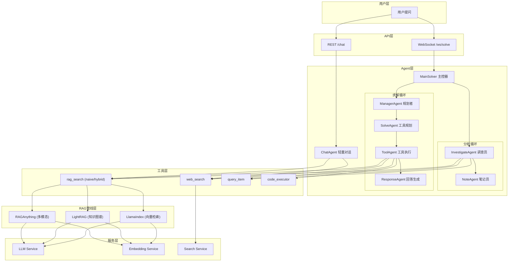
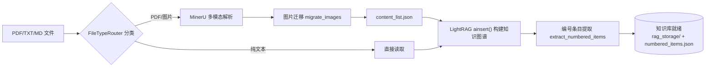
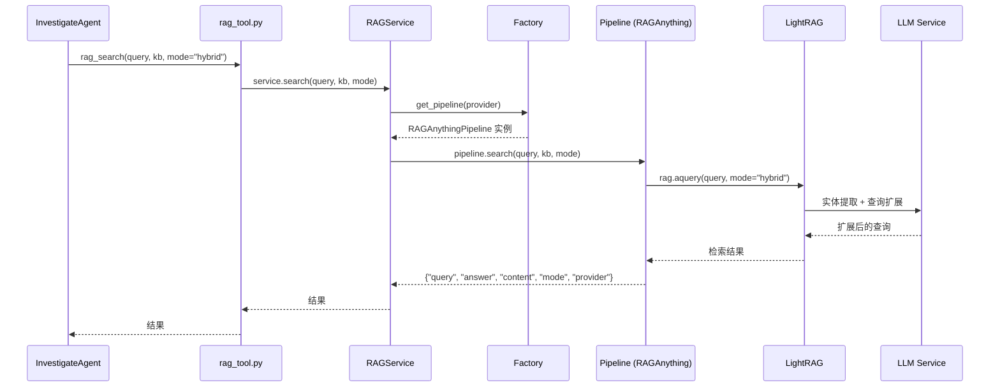
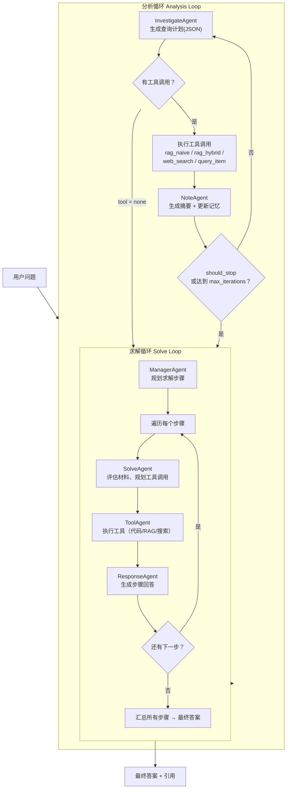
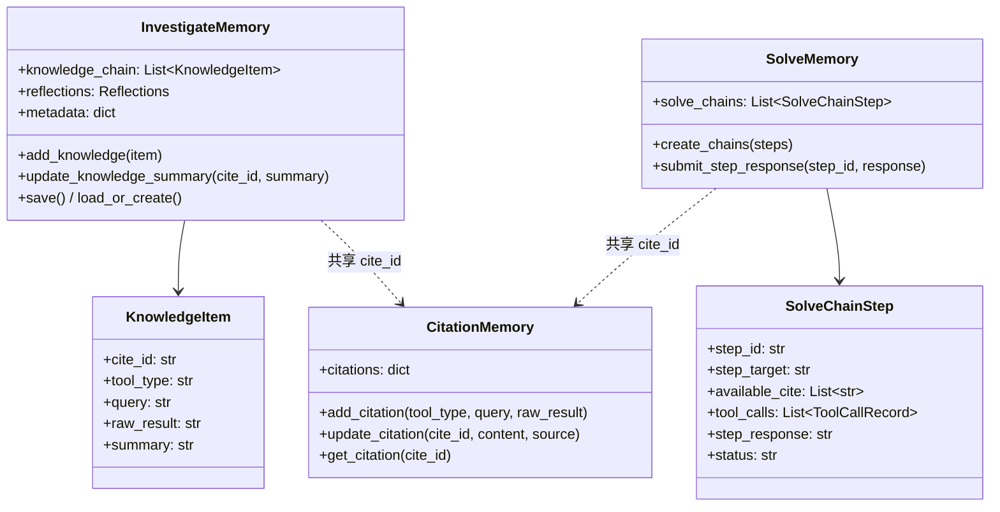
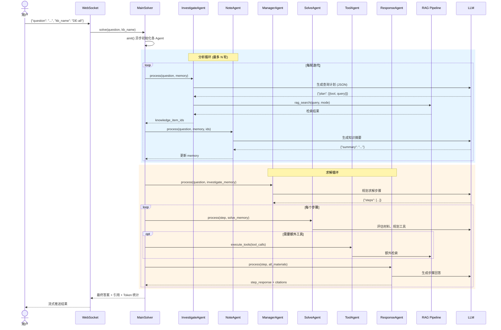

# DeepTutor RAG 多跳推理系统 · 深度分析文档

## 目录

- [1. 系统全景](#1-系统全景)
- [2. 数据处理管线](#2-数据处理管线)
- [3. 检索管线架构](#3-检索管线架构)
- [4. 多跳推理核心：双循环架构](#4-多跳推理核心双循环架构)
- [5. 记忆系统](#5-记忆系统)
- [6. 端到端问答流程](#6-端到端问答流程)
- [7. 关键设计决策总结](#7-关键设计决策总结)

---

## 1. 系统全景

DeepTutor 是一个面向学术文档的智能问答系统，其核心特色是**基于 Agent 的多跳推理**——能够将复杂问题分解为多个子查询，迭代检索和推理，最终综合出完整答案。



### 核心目录结构

| 目录                                                                        | 职责                                       |
| --------------------------------------------------------------------------- | ------------------------------------------ |
| [src/api/routers/](file:///c:/D/work/zs/DeepTutor/src/api/routers/)         | API 路由（WebSocket 求解、REST 聊天）      |
| [src/agents/](file:///c:/D/work/zs/DeepTutor/src/agents/)                   | Agent 系统（solve 双循环 + chat 对话）     |
| [src/tools/](file:///c:/D/work/zs/DeepTutor/src/tools/)                     | 工具封装层（RAG 搜索、Web 搜索、代码执行） |
| [src/services/rag/](file:///c:/D/work/zs/DeepTutor/src/services/rag/)       | RAG 管线层（管道工厂 + 三种实现）          |
| [src/services/llm/](file:///c:/D/work/zs/DeepTutor/src/services/llm/)       | 统一 LLM 调用服务                          |
| [src/services/search/](file:///c:/D/work/zs/DeepTutor/src/services/search/) | Web 搜索服务（多 Provider）                |

---

## 2. 数据处理管线

文档被上传后，经历 **解析 → 分块 → 索引** 三个阶段进入知识库。



### 2.1 三种管线对比

| 特性         | RAGAnything                                                                                | LightRAG                                                                             | LlamaIndex                                                                               |
| ------------ | ------------------------------------------------------------------------------------------ | ------------------------------------------------------------------------------------ | ---------------------------------------------------------------------------------------- |
| **文件**     | [raganything.py](file:///c:/D/work/zs/DeepTutor/src/services/rag/pipelines/raganything.py) | [lightrag.py](file:///c:/D/work/zs/DeepTutor/src/services/rag/pipelines/lightrag.py) | [llamaindex.py](file:///c:/D/work/zs/DeepTutor/src/services/rag/pipelines/llamaindex.py) |
| **解析**     | MinerU（图像/表格/公式）                                                                   | PDFParser（纯文本）                                                                  | LlamaIndex SimpleDirectoryReader                                                         |
| **索引**     | LightRAG 知识图谱                                                                          | LightRAG 知识图谱                                                                    | VectorStoreIndex 向量索引                                                                |
| **检索**     | hybrid/local/global/naive                                                                  | hybrid/local/global/naive                                                            | 向量相似度查询                                                                           |
| **多模态**   | ✅ 完整支持                                                                                | ❌ 纯文本                                                                            | ❌ 纯文本                                                                                |
| **速度**     | 慢（最彻底）                                                                               | 中等                                                                                 | 快（纯向量）                                                                             |
| **适用场景** | 学术论文（默认）                                                                           | 文本密集型文档                                                                       | 快速检索                                                                                 |

### 2.2 管线选择机制

[RAGService](file:///c:/D/work/zs/DeepTutor/src/services/rag/service.py) → [RAGPipelineFactory](file:///c:/D/work/zs/DeepTutor/src/services/rag/factory.py) 通过以下优先级选择管线：

1. **知识库元数据** `metadata.json` 中的 `provider` 字段
2. **环境变量** `RAG_PROVIDER`
3. **默认值** `raganything`

工厂采用**懒加载**，仅在首次请求时导入对应管线的重量级依赖。

---

## 3. 检索管线架构

当 Agent 发起 `rag_search()` 调用时，请求沿以下路径流转：



### 3.1 检索模式

LightRAG 支持 4 种检索模式（在 [LightRAGRetriever](file:///c:/D/work/zs/DeepTutor/src/services/rag/components/retrievers/lightrag.py) 中实现）：

| 模式       | 说明                                 | 适用场景                 |
| ---------- | ------------------------------------ | ------------------------ |
| **naive**  | 基础实体匹配，直接关键词检索         | 明确的事实性问题         |
| **local**  | 局部子图检索，聚焦相关实体的邻居节点 | 具体概念的详细解释       |
| **global** | 全局图推理，利用社区结构跨主题检索   | 跨章节综合问题           |
| **hybrid** | local + global 混合，兼顾深度和广度  | **默认模式**，大多数问题 |

---

## 4. 多跳推理核心：双循环架构

> [!IMPORTANT]
> **双循环架构**是 DeepTutor 区别于传统 RAG 的核心创新。传统 RAG 执行"一次检索→直接回答"，而 DeepTutor 通过多轮迭代的分析循环积累知识，再通过结构化的求解循环生成高质量答案。

核心实现位于 [MainSolver.\_run_dual_loop_pipeline](file:///c:/D/work/zs/DeepTutor/src/agents/solve/main_solver.py#L283)。



### 4.1 分析循环详解

**目标：** 迭代收集和理解回答问题所需的所有信息。

#### InvestigateAgent（调查员）

- **文件：** [investigate_agent.py](file:///c:/D/work/zs/DeepTutor/src/agents/solve/analysis_loop/investigate_agent.py)
- **输入：** 用户问题 + 已有知识链 + 剩余问题列表
- **输出格式：** JSON `{ "reasoning": "...", "plan": [{"tool": "rag_hybrid", "query": "..."}, ...] }`
- **支持工具：**
  - `rag_naive` — 基础关键词检索
  - `rag_hybrid` — 混合图检索（默认首选）
  - `web_search` — 网络搜索（可配置关闭）
  - `query_item` — 查询编号条目（定义、定理等）
  - `none` — 信息已充足，停止调查

**多跳推理示例流程：**

```
问题: "FPGA 中 LUT 的时序特性如何影响流水线设计？"

第1轮 → InvestigateAgent 生成:
  plan: [{"tool": "rag_hybrid", "query": "FPGA LUT lookup table 基本原理"}]
  → 获得 LUT 基于 SRAM 的结构知识

第2轮 → 基于第1轮知识 + 剩余问题:
  plan: [{"tool": "rag_hybrid", "query": "LUT 时序延迟 propagation delay"}]
  → 获得 LUT 的时序参数知识

第3轮 → 发现需要更深入了解:
  plan: [{"tool": "rag_naive", "query": "流水线寄存器 pipeline register 时钟周期"}]
  → 获得流水线设计相关知识

第4轮 → 信息充足:
  plan: [{"tool": "none"}]  → should_stop = True
```

每轮关键代码逻辑（[investigate_agent.py:L148-L197](file:///c:/D/work/zs/DeepTutor/src/agents/solve/analysis_loop/investigate_agent.py#L148-L197)）：

```python
# 限制每轮最大动作数
tool_plans_to_execute = tool_plans[: self.max_actions_per_round]

for plan in tool_plans_to_execute:
    # 执行单个工具调用
    knowledge_item = await self._execute_single_action(
        tool_selection=tool_type,
        query=query,
        identifier=identifier,
        kb_name=kb_name,
        citation_memory=citation_memory,
    )
    # 将知识存入记忆链
    if knowledge_item:
        memory.add_knowledge(knowledge_item)
        knowledge_ids.append(knowledge_item.cite_id)
```

#### NoteAgent（笔记员）

- **文件：** [note_agent.py](file:///c:/D/work/zs/DeepTutor/src/agents/solve/analysis_loop/note_agent.py)
- **职责：** 对每个新获取的知识项生成结构化摘要
- **输出：** `{ "summary": "...", "citations": [...] }`
- **关键操作：** 调用 `memory.update_knowledge_summary(cite_id, summary)` 更新记忆

### 4.2 求解循环详解

**目标：** 基于分析循环积累的知识，结构化地生成最终答案。

#### ManagerAgent（规划者）

- **文件：** [manager_agent.py](file:///c:/D/work/zs/DeepTutor/src/agents/solve/solve_loop/manager_agent.py)
- **输入：** 用户问题 + 知识链摘要
- **输出格式：**

```json
{
  "steps": [
    {
      "step_id": "S1",
      "role": "解释",
      "target": "LUT 的基本结构",
      "cite_ids": ["[1]"]
    },
    {
      "step_id": "S2",
      "role": "分析",
      "target": "时序延迟对流水线的影响",
      "cite_ids": ["[1]", "[2]"]
    },
    {
      "step_id": "S3",
      "role": "总结",
      "target": "综合设计建议",
      "cite_ids": ["[1]", "[2]", "[3]"]
    }
  ]
}
```

#### SolveAgent → ToolAgent → ResponseAgent 执行链

对每个步骤按顺序执行：

| Agent             | 文件                                                                                              | 职责                                                             |
| ----------------- | ------------------------------------------------------------------------------------------------- | ---------------------------------------------------------------- |
| **SolveAgent**    | [solve_agent.py](file:///c:/D/work/zs/DeepTutor/src/agents/solve/solve_loop/solve_agent.py)       | 评估当前步骤的已有材料，决定是否需要额外工具调用                 |
| **ToolAgent**     | [tool_agent.py](file:///c:/D/work/zs/DeepTutor/src/agents/solve/solve_loop/tool_agent.py)         | 执行工具调用（代码执行、RAG 搜索、Web 搜索），收集产物（如图片） |
| **ResponseAgent** | [response_agent.py](file:///c:/D/work/zs/DeepTutor/src/agents/solve/solve_loop/response_agent.py) | 基于所有材料生成该步骤的正式回答，包含引用标记 `[cite_id]`       |

### 4.3 ChatAgent 轻量路径

对于不需要多跳推理的简单问题，系统提供 [ChatAgent](file:///c:/D/work/zs/DeepTutor/src/agents/chat/chat_agent.py) 作为轻量级替代：

```
用户消息 → 历史截断(token限制) → 可选RAG/Web检索 → 构建消息列表 → LLM流式生成 → 回答
```

ChatAgent 支持多轮对话、RAG 增强和 Web 搜索，但**不执行多跳推理**。

---

## 5. 记忆系统

多跳推理的关键支撑是**结构化记忆系统**，位于 [src/agents/solve/memory/](file:///c:/D/work/zs/DeepTutor/src/agents/solve/memory/)。



**统一引用 ID 系统：** 所有记忆模块通过 `cite_id`（如 `[1]`, `[2]`）互联互通，确保从最初的 RAG 检索到最终答案中的引用标记全程可追踪。

---

## 6. 端到端问答流程

以一个复杂问题的完整处理流程为例：



### 关键入口文件

- **WebSocket 端点：** [solve.py](file:///c:/D/work/zs/DeepTutor/src/api/routers/solve.py) 中的 `websocket_solve()`
  - 接收 WebSocket 连接，解析 `question` 和 `kb_name`
  - 创建 `MainSolver` 实例并调用 `solve()`
  - 实时推送日志、进度和最终结果

---

## 7. 关键设计决策总结

| 设计               | 决策                                | 理由                                                            |
| ------------------ | ----------------------------------- | --------------------------------------------------------------- |
| **多跳推理**       | Agent 双循环（分析+求解）           | 传统单次检索无法处理需要综合多段信息的复杂问题                  |
| **管线工厂**       | 懒加载 + Provider 模式              | RAGAnything 依赖 MinerU 等重量级库，启动时不必全部加载          |
| **检索模式**       | LightRAG 知识图谱 + hybrid 混合检索 | 知识图谱捕获实体关系，hybrid 兼顾局部深度和全局广度             |
| **记忆系统**       | 统一 cite_id 贯穿全程               | 从检索到最终答案的引用全程可追踪                                |
| **Agent 专业化**   | 每个 Agent 只做一件事               | InvestigateAgent 只调查，NoteAgent 只记录，ResponseAgent 只回答 |
| **ChatAgent 旁路** | 简单问题走轻量路径                  | 不是所有问题都需要多跳推理，避免不必要的开销                    |
| **多模态支持**     | MinerU 解析图像/表格/公式           | 学术文档中图表和公式是关键信息载体                              |
| **Token 追踪**     | BaseAgent 内置 token_tracker        | 监控 LLM 调用成本，支持多模型统计                               |

> [!TIP]
> **系统的核心创新点**在于将传统 RAG 的"单次检索→回答"范式升级为"多轮调查→结构化求解"范式。InvestigateAgent 像研究者一样不断提出新问题、检索新资料、记录新发现，直到认为信息充足；然后 ManagerAgent 像项目经理一样分步骤规划答案结构，最终由 ResponseAgent 综合所有材料生成带引用的高质量回答。
