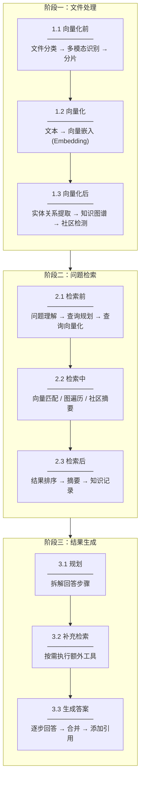
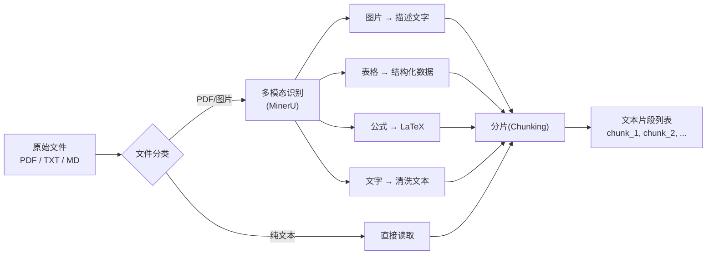
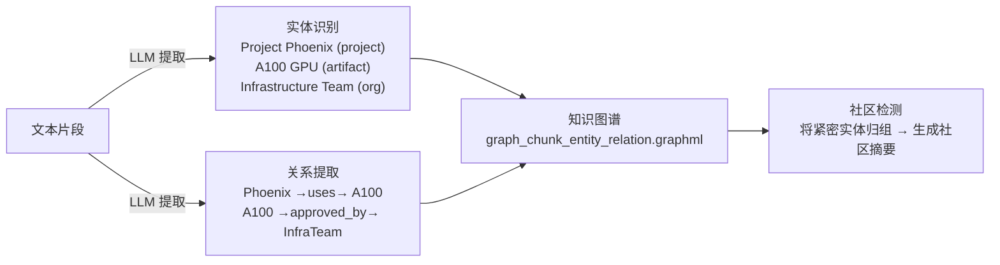
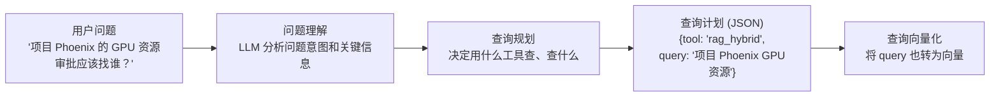
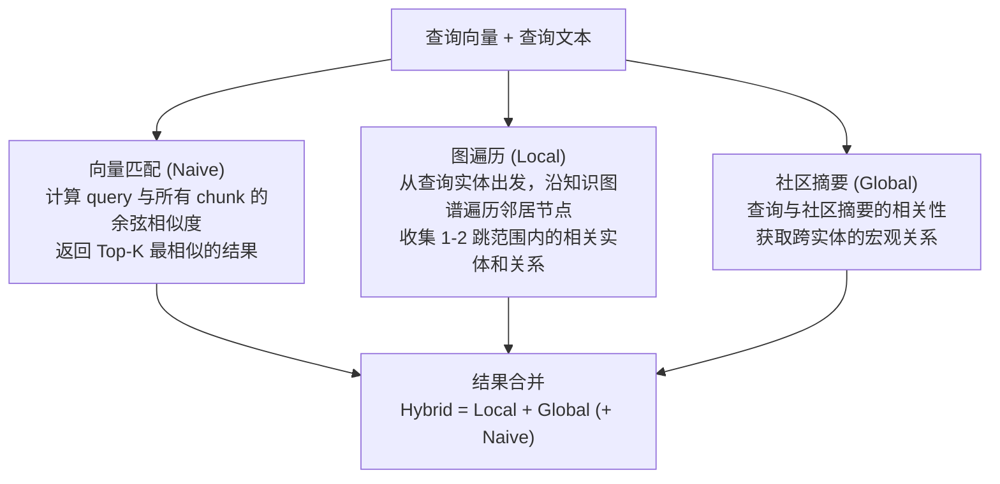
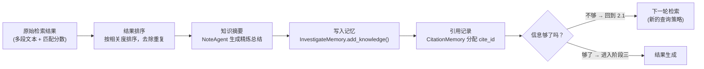
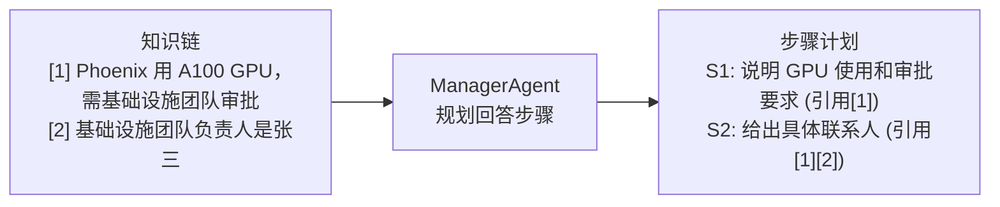
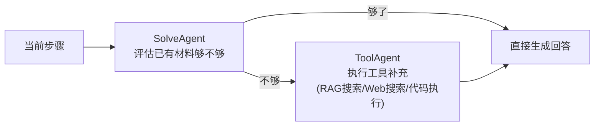
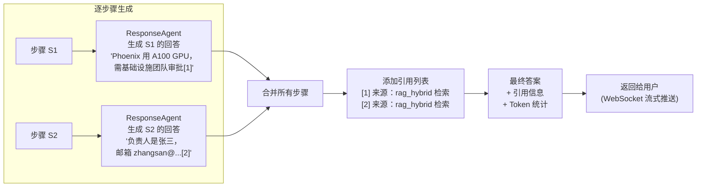

# RAG 系统整体流程：从文件到答案

本文档将 RAG 系统的完整工作流程按**三大阶段**梳理，每个阶段再细分为前中后环节。以 DeepTutor 项目为基准，同时标注通用 RAG 系统的做法。

---

## 全景流程图



---

## 阶段一：文件处理

将原始文件转化为可被检索的结构化数据。

### 1.1 向量化前

目标：将原始文件转为**干净的文本片段**，准备好给 Embedding 模型处理。



| 步骤           | 做什么                               | DeepTutor 实现                    | 说明                                   |
| -------------- | ------------------------------------ | --------------------------------- | -------------------------------------- |
| **文件分类**   | 按扩展名判断文件类型，走不同处理路径 | `FileTypeRouter.classify_files()` | `.txt/.md` 走快速路径，`.pdf` 走解析器 |
| **多模态识别** | 解析 PDF 中的图片、表格、公式        | MinerU（仅 RAGAnything 模式）     | 非必有。LightRAG/LlamaIndex 跳过此步   |
| **分片**       | 将长文本切分为合适大小的片段         | LightRAG 内部按 token 数自动分块  | 每个 chunk 通常 300-1000 tokens        |

> **为什么要分片？**
>
> - Embedding 模型有最大 token 限制（如 8192 tokens）
> - 太长的文本嵌入后语义模糊，太短的又缺少上下文
> - 分片的粒度直接影响检索精度

### 1.2 向量化

目标：将文本片段转为**高维向量**，使"语义相近的文本"在向量空间中距离也近。

```
"项目 Phoenix 使用了 NVIDIA A100 GPU 集群进行大模型训练"
          ↓ Embedding 模型 (如 text-embedding-3-small)
    [0.021, -0.053, 0.118, ..., 0.007]  ← 1536维向量
```

| 步骤           | 做什么                                     | DeepTutor 实现                                                | 说明                                  |
| -------------- | ------------------------------------------ | ------------------------------------------------------------- | ------------------------------------- |
| **文本向量化** | 调用 Embedding 模型，将每个 chunk 转为向量 | `get_embedding_client().get_embedding_func()`                 | 所有模式都有此步（LightRAG 内部完成） |
| **向量存储**   | 将向量写入索引，支持快速近邻查询           | LightRAG → `vdb_chunks.json`；LlamaIndex → `VectorStoreIndex` | 后续检索时用余弦相似度匹配            |

> **直观理解向量化：**
>
> ```
> "A100 GPU 集群"   → [0.82, 0.15, ...]  ──┐
> "A100 GPU"        → [0.80, 0.16, ...]  ──┤ 语义相近 → 向量距离近
> "A100 显卡"       → [0.78, 0.18, ...]  ──┘
>
> "张三的邮箱"      → [0.12, 0.91, ...]     语义无关 → 向量距离远
> ```
>
> 这就是为什么即使实体名称不同（"GPU 集群" vs "GPU"），向量检索仍能匹配上。

### 1.3 向量化后

目标：在向量索引之上，构建**更高层次的结构化知识**。



| 步骤             | 做什么                               | DeepTutor 实现                                     | 说明                           |
| ---------------- | ------------------------------------ | -------------------------------------------------- | ------------------------------ |
| **实体提取**     | LLM 从每个 chunk 中识别出命名实体    | LightRAG `rag.ainsert()` 内部调用 LLM              | 非必有。LlamaIndex 模式跳过    |
| **关系提取**     | LLM 识别实体间的关系（用途、从属等） | 同上                                               | 非必有。LlamaIndex 模式跳过    |
| **知识图谱构建** | 将实体和关系组装成图结构             | 存储为 GraphML 格式                                | 支持图遍历检索                 |
| **社区检测**     | 对图谱运行聚类算法，生成社区摘要     | LightRAG Leiden 算法                               | 支持 global 全局检索           |
| **编号条目提取** | 从文档中提取定义、定理等编号项       | `extract_numbered_items()` → `numbered_items.json` | 支持 `query_item` 工具精确查询 |

> **三种模式在此阶段的差异：**
>
> | 步骤     | LightRAG | RAGAnything | LlamaIndex |
> | -------- | -------- | ----------- | ---------- |
> | 实体提取 | ✅       | ✅          | ❌ 跳过    |
> | 关系提取 | ✅       | ✅          | ❌ 跳过    |
> | 知识图谱 | ✅       | ✅          | ❌ 无      |
> | 社区检测 | ✅       | ✅          | ❌ 无      |
>
> LlamaIndex 模式在向量化后就结束了——**没有"向量化后"这个阶段**。

### 📦 文件处理最终产物

```
data/knowledge_bases/{知识库名}/
├── rag_storage/
│   ├── vdb_chunks.json                    # 向量索引 (1.2 的产物)
│   ├── graph_chunk_entity_relation.graphml # 知识图谱 (1.3 的产物)
│   ├── kv_store_full_docs.json            # 原始文档
│   ├── kv_store_text_chunks.json          # 文本分块 (1.1 的产物)
│   └── kv_store_llm_response_cache.json   # LLM 调用缓存
├── numbered_items.json                     # 编号条目 (1.3 的产物)
└── metadata.json                           # 知识库元信息 (provider, 创建时间等)
```

---

## 阶段二：问题检索

用户提出问题后，系统核心需要从知识库中找到最相关的信息。

### 2.1 检索前

目标：理解用户问题，制定**检索策略**。



| 步骤           | 做什么                             | DeepTutor 实现                       | 说明                                          |
| -------------- | ---------------------------------- | ------------------------------------ | --------------------------------------------- |
| **问题理解**   | LLM 分析说问题的意图、需要哪些信息 | `InvestigateAgent` 的 reasoning 输出 | Agent 会考虑"已有知识"和"缺什么"              |
| **查询规划**   | 决定使用什么工具、发什么查询       | `InvestigateAgent` 的 plan 输出      | 可以同时发多个查询（`max_actions_per_round`） |
| **查询选择**   | 选择检索模式（naive/hybrid 等）    | plan 中的 `tool` 字段                | hybrid 是默认首选                             |
| **查询向量化** | 将查询文本转为向量，用于相似度匹配 | Embedding 模型处理 query             | 与文件处理时用同一个 Embedding 模型           |

> **这一步的关键是"查询规划"——不是直接把用户原问题丢给检索，而是由 LLM 先分析后生成更精准的查询。**
>
> 例如，用户问"项目 Phoenix 的 GPU 资源审批应该找谁？"
>
> - ❌ 直接检索原问题 → 太长太散，检索效果差
> - ✅ InvestigateAgent 拆解为 → `"项目 Phoenix GPU 资源"` → 更聚焦

### 2.2 检索中

目标：从知识库中**找到与查询最相关的信息**。



| 检索方式               | 做什么                     | 擅长什么                   | 短板                           |
| ---------------------- | -------------------------- | -------------------------- | ------------------------------ |
| **Naive（向量匹配）**  | 用余弦相似度找最近的 chunk | 模糊匹配、同义词、近义表述 | 不理解结构化关系               |
| **Local（图遍历）**    | 从实体节点出发遍历知识图谱 | 精确的实体关系追踪         | 依赖实体提取质量，图断裂就不行 |
| **Global（社区摘要）** | 检索社区级别的概括信息     | 跨文档的宏观理解           | 摘要可能丢失细节               |
| **Hybrid（混合）**     | Local + Global 合并        | 兼顾深度和广度             | 计算成本稍高                   |

> **用企业知识库的例子理解：**
>
> 查询"项目 Phoenix GPU 资源"：
>
> | 检索方式   | 能找到什么                                                                                   |
> | ---------- | -------------------------------------------------------------------------------------------- |
> | Naive      | ✅ 匹配到"项目 Phoenix 使用了 A100 GPU 集群" + "A100 GPU 需审批"（向量语义近）               |
> | Local      | ✅ Phoenix →uses→ A100 GPU Cluster（直接图遍历），但 ❌ 到不了 Infrastructure Team（图断裂） |
> | Global     | ✅ 社区摘要包含"A100 GPU 使用需要审批"的整体关系                                             |
> | **Hybrid** | ✅ 三者合并 → 最完整的结果                                                                   |

### 2.3 检索后

目标：对原始检索结果进行**处理和筛选**，形成结构化的知识记录。



| 步骤           | 做什么                                | DeepTutor 实现                           | 说明                                           |
| -------------- | ------------------------------------- | ---------------------------------------- | ---------------------------------------------- |
| **结果排序**   | 按相关性评分排序，去除重复片段        | RAG 管线 `search()` 返回的有序结果       | LightRAG 内部已排序                            |
| **知识摘要**   | LLM 对原始结果生成简洁的总结          | `NoteAgent.process()`                    | 将冗长的原文压缩为关键信息                     |
| **写入记忆**   | 将摘要存入知识链，供后续检索/生成使用 | `InvestigateMemory.add_knowledge()`      | 每条分配唯一 `cite_id`                         |
| **引用记录**   | 记录来源信息（工具类型、查询、原文）  | `CitationMemory.add_citation()`          | 最终答案中的 [1][2] 引用来自这里               |
| **充分性判断** | LLM 判断已有信息是否足够回答问题      | `InvestigateAgent` 的 `should_stop` 输出 | 不够 → 回到 2.1 继续检索（**多跳推理的关键**） |

> **多跳推理就发生在"检索后 → 检索前"的循环中：**
>
> ```
> 第1轮: 检索前(查 Phoenix GPU) → 检索中 → 检索后(知道需要基础设施团队审批，但不知道找谁)
>   → 信息不够！回到检索前
> 第2轮: 检索前(查 基础设施团队负责人) → 检索中 → 检索后(知道找张三)
>   → 信息够了！进入结果生成
> ```

---

## 阶段三：结果生成

基于检索阶段积累的所有知识，结构化地生成最终答案。

### 3.1 规划

目标：将复杂问题**拆解为可回答的步骤**。



| 步骤         | 做什么                                   | DeepTutor 实现           |
| ------------ | ---------------------------------------- | ------------------------ |
| **步骤规划** | LLM 根据知识链，将答案拆为逻辑清晰的步骤 | `ManagerAgent.process()` |
| **引用分配** | 每个步骤标注需要用到哪些知识项           | 步骤中的 `cite_ids` 字段 |

### 3.2 补充检索（按需）

目标：如果某个步骤的现有材料**不足以回答**，执行补充检索。



| 步骤             | 做什么                                  | DeepTutor 实现              |
| ---------------- | --------------------------------------- | --------------------------- |
| **材料评估**     | 判断当前步骤的知识材料是否充分          | `SolveAgent.process()`      |
| **补充工具调用** | 执行额外的 RAG 检索、Web 搜索或代码执行 | `ToolAgent.execute_tools()` |

> 大多数时候，分析循环已经收集了足够的信息，这一步不需要额外检索。

### 3.3 生成答案

目标：基于所有材料，**生成最终的、带引用的答案**。



| 步骤         | 做什么                                       | DeepTutor 实现                      |
| ------------ | -------------------------------------------- | ----------------------------------- |
| **逐步回答** | 对每个步骤，LLM 基于分配的材料生成该步的回答 | `ResponseAgent.process()`           |
| **引用标记** | 在回答中标注信息来源 `[1]` `[2]`             | ResponseAgent 插入 `cite_id`        |
| **合并汇总** | 将所有步骤的回答组合为完整答案               | `MainSolver` 合并所有 step_response |
| **附加信息** | 添加引用列表、Token 使用统计                 | `CitationMemory` + `TokenTracker`   |
| **流式推送** | 通过 WebSocket 实时推送给前端                | `websocket_solve()`                 |

---

## 完整时序（结合企业知识库例子）

```
用户提问: "项目 Phoenix 的 GPU 资源审批应该找谁？"

═══════════════ 阶段二：问题检索 ═══════════════

【2.1 检索前 · 第1轮】
  InvestigateAgent 分析：需要了解 Phoenix 项目的 GPU 使用情况
  生成查询：{tool: "rag_hybrid", query: "项目 Phoenix GPU 资源"}
  查询向量化："项目 Phoenix GPU 资源" → [0.73, 0.21, ...]

【2.2 检索中 · 第1轮】
  Naive: "项目 Phoenix...A100 GPU 集群" (相似度 0.92) ✅
         "所有使用 A100 GPU...基础设施团队审批" (相似度 0.78) ✅
  Local: Project Phoenix →uses→ A100 GPU Cluster ✅
  Global: 社区摘要 "A100 GPU 相关项目需 Infrastructure Team 审批" ✅

【2.3 检索后 · 第1轮】
  NoteAgent 摘要：[1] "Phoenix 用 A100 GPU 集群，需基础设施团队审批"
  充分性判断：❌ 不知道基础设施团队的具体联系人 → 继续检索

【2.1 检索前 · 第2轮】
  InvestigateAgent 分析：已知需要基础设施团队审批，但不知道找谁
  生成查询：{tool: "rag_hybrid", query: "基础设施团队 负责人 联系方式"}

【2.2 检索中 · 第2轮】
  Naive: "基础设施团队的负责人是张三" (相似度 0.95) ✅
  Local: Infrastructure Team →led_by→ 张三 ✅

【2.3 检索后 · 第2轮】
  NoteAgent 摘要：[2] "基础设施团队负责人是张三，邮箱 zhangsan@company.com"
  充分性判断：✅ 信息充足 → 进入结果生成

═══════════════ 阶段三：结果生成 ═══════════════

【3.1 规划】
  ManagerAgent 规划：
    S1: 确认 GPU 使用情况和审批要求 (引用[1])
    S2: 确定审批负责人及联系方式 (引用[1][2])

【3.2 补充检索】
  SolveAgent 评估：材料充足，跳过

【3.3 生成答案】
  S1 回答："项目 Phoenix 使用 NVIDIA A100 GPU 集群[1]，需基础设施团队审批[1]。"
  S2 回答："基础设施团队负责人是张三，邮箱 zhangsan@company.com[2]。"

  最终答案：
  ┌─────────────────────────────────────────────────┐
  │ 项目 Phoenix 使用了 NVIDIA A100 GPU 集群[1]，     │
  │ 根据公司规定需要基础设施团队审批[1]。              │
  │ 基础设施团队的负责人是张三，                       │
  │ 联系邮箱 zhangsan@company.com[2]。                │
  │                                                   │
  │ 因此，GPU 资源审批应该找张三。                     │
  │                                                   │
  │ 引用：                                             │
  │ [1] RAG 检索: "项目 Phoenix GPU 资源"              │
  │ [2] RAG 检索: "基础设施团队 负责人 联系方式"       │
  └─────────────────────────────────────────────────┘
```

---

## 三种模式在各阶段的差异一览

| 阶段             | 步骤               | LightRAG             | RAGAnything | LlamaIndex  |
| ---------------- | ------------------ | -------------------- | ----------- | ----------- |
| **1.1 向量化前** | 多模态识别         | ❌ 跳过              | ✅ MinerU   | ❌ 跳过     |
|                  | 分片               | ✅ 内部完成          | ✅ 内部完成 | ✅ 内部完成 |
| **1.2 向量化**   | 文本嵌入           | ✅ 内部完成          | ✅ 内部完成 | ✅ 内部完成 |
| **1.3 向量化后** | 实体/关系提取      | ✅                   | ✅          | ❌ 无       |
|                  | 知识图谱           | ✅                   | ✅          | ❌ 无       |
|                  | 社区检测           | ✅                   | ✅          | ❌ 无       |
| **2.2 检索中**   | 向量匹配 (Naive)   | ✅                   | ✅          | ✅ 唯一方式 |
|                  | 图遍历 (Local)     | ✅                   | ✅          | ❌ 无       |
|                  | 社区摘要 (Global)  | ✅                   | ✅          | ❌ 无       |
|                  | Hybrid 混合        | ✅                   | ✅          | ❌ 无       |
| **其他阶段**     | 检索前/后/结果生成 | 三种模式**完全一致** | —           | —           |

> **关键差异只在两个地方：1.3 向量化后（要不要建图谱）和 2.2 检索中（有几种检索方式）。**
>
> 其余所有阶段——检索前的查询规划、检索后的知识摘要、结果生成的步骤规划——都一模一样，因为这些都由 Agent 系统处理，跟底层 RAG 管线无关。
