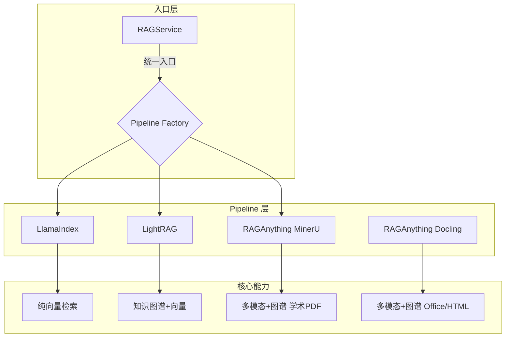
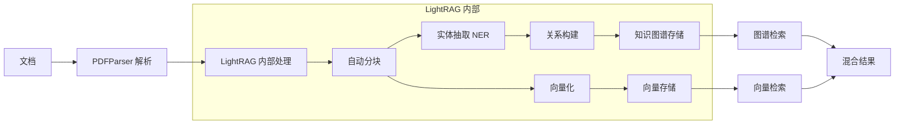
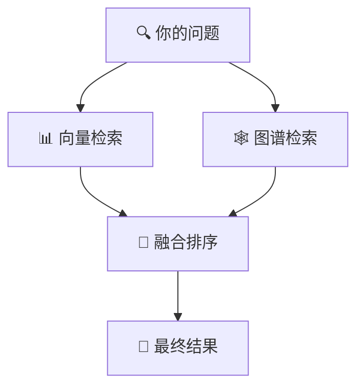
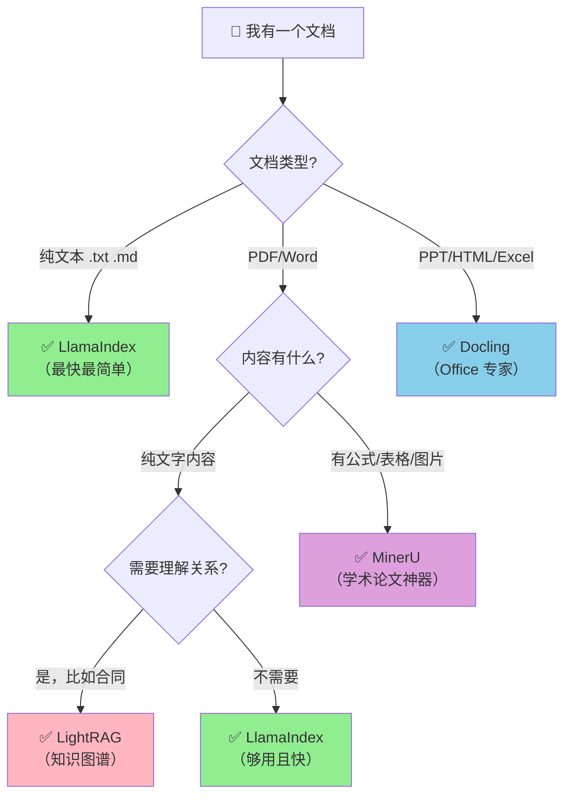

# DeepTutor RAG 服务深度分析

> **文档目的**: 深入分析 DeepTutor 项目的 RAG (Retrieval-Augmented Generation) 服务架构，帮助理解各种 Pipeline 和检索模式的技术原理与适用场景。

---

## 🎯 小白必读：什么是 RAG？

### 用大白话解释

想象你是一个客服，用户问你问题。你有两种回答方式：

1. **纯靠记忆回答**（传统 AI）→ 可能会"胡说八道"，因为训练时没见过这些知识
2. **先查资料再回答**（RAG）→ 先从公司知识库找到相关内容，再基于这些内容回答

**RAG = R**etrieval（检索）+ **A**ugmented（增强）+ **G**eneration（生成）

简单说：**先搜索，再回答**。

### 为什么需要不同的 Pipeline？

不同类型的文档，需要用不同的方式来处理：

| 你的文档类型 | 难点 | 需要的能力 |
|-------------|------|-----------|
| 纯文字 TXT | 无 | 基础文本处理就行 |
| 商业合同 | 需要理解"甲方乙方"的关系 | **知识图谱**（谁和谁有什么关系）|
| 学术论文 | 有数学公式 $E=mc^2$ | **公式识别**（OCR 转 LaTeX）|
| PPT/Word | 格式复杂 | **多格式解析** |

所以 DeepTutor 提供了 4 种 Pipeline，各有所长！

---

## 一、架构概览



### 1.1 核心组件

| 组件 | 文件位置 | 职责 |
|------|----------|------|
| **RAGService** | `src/services/rag/service.py` | 统一入口，提供 `initialize`/`search`/`delete` 接口 |
| **Pipeline Factory** | `src/services/rag/factory.py` | 懒加载创建 Pipeline 实例 |
| **RAGPipeline** | `src/services/rag/pipeline.py` | 可组合的 Pipeline 基类，支持 Fluent API |
| **FileTypeRouter** | `src/services/rag/components/routing.py` | 文件类型分类与路由 |

---

## 二、四种 Pipeline 深度解析

### 📊 一图看懂四种 Pipeline

```
┌──────────────────────────────────────────────────────────────────────────┐
│                         Pipeline 对比一览图                               │
├──────────────────────────────────────────────────────────────────────────┤
│                                                                          │
│  LlamaIndex        LightRAG         RAGAnything      RAGAnything         │
│  (最简单)          (图谱版)          (MinerU)         (Docling)           │
│                                                                          │
│  ┌─────┐          ┌─────┐          ┌─────┐          ┌─────┐              │
│  │文本 │          │文本 │          │文本 │          │文本 │              │
│  └──┬──┘          └──┬──┘          │公式 │          │Office│              │
│     │                │             │图片 │          │HTML │              │
│     │                │             │表格 │          └──┬──┘              │
│     ▼                ▼             └──┬──┘             │                 │
│  ┌─────┐          ┌─────┐            │              ┌─────┐              │
│  │向量 │          │向量 │            ▼              │向量 │              │
│  │存储 │          │存储 │         ┌─────┐          │存储 │              │
│  └─────┘          └──┬──┘         │向量 │          └──┬──┘              │
│                      │            │存储 │             │                 │
│                   ┌─────┐         └──┬──┘          ┌─────┐              │
│                   │知识 │            │             │知识 │              │
│                   │图谱 │         ┌─────┐          │图谱 │              │
│                   └─────┘         │知识 │          └─────┘              │
│                                   │图谱 │                               │
│                                   └─────┘                               │
│                                                                          │
│  速度: ⚡⚡⚡       速度: ⚡⚡        速度: ⚡          速度: ⚡⚡           │
│  效果: ★★★        效果: ★★★★      效果: ★★★★★      效果: ★★★★         │
│                                                                          │
└──────────────────────────────────────────────────────────────────────────┘
```

### 2.1 LlamaIndex Pipeline

📁 `src/services/rag/pipelines/llamaindex.py`

#### 🎓 小白理解

这是最简单的方案，就像**把整本书撕成小纸条，每张纸条都变成一串数字（向量），然后用"找最像的纸条"的方式来回答问题**。

#### 技术架构


#### 特点

| 项目 | 说明 |
|------|------|
| **底层技术** | LlamaIndex 原生库 + VectorStoreIndex |
| **检索方式** | 纯向量相似度检索 (Cosine Similarity) |
| **处理速度** | ⚡ **最快** (约 2-5 秒/文档) |
| **内存占用** | 较低 |
| **适用场景** | 简单文本、快速原型、对速度要求高 |

#### ✅ 最佳适用文件类型

| 文件类型 | 示例 | 效果 |
|----------|------|------|
| 纯文本 | `.txt`, `.md`, `.json` | ⭐⭐⭐⭐⭐ 效果极佳 |
| 简单 PDF | 纯文字 PDF (无公式/图表) | ⭐⭐⭐⭐ 效果良好 |
| 代码文件 | `.py`, `.js`, `.java` | ⭐⭐⭐⭐ 效果良好 |

#### ❌ 不推荐场景

- 包含数学公式的学术论文
- 需要理解"谁和谁有什么关系"的文档

---

### 2.2 LightRAG Pipeline

📁 `src/services/rag/pipelines/lightrag.py`

#### 🎓 小白理解

这个方案在向量的基础上，还会**构建一张"关系网"（知识图谱）**。比如从合同中识别出"甲方"→"负责"→"付款"这种关系。这样当你问"甲方要做什么"时，它能精确地找到甲方相关的所有信息。

#### 技术架构



#### 特点

| 项目 | 说明 |
|------|------|
| **底层技术** | LightRAG 库（知识图谱 + 向量双存储）|
| **检索方式** | 支持 naive/local/global/hybrid 四种模式 |
| **处理速度** | ⚡ **中速** (约 10-15 秒/文档) |
| **知识表示** | 实体-关系图谱 + 社区摘要 |
| **适用场景** | 商业文档、需要关系推理的场景 |

#### ✅ 最佳适用文件类型

| 文件类型 | 示例 | 效果 |
|----------|------|------|
| 商业文档 | 商业计划书、战略报告 | ⭐⭐⭐⭐⭐ 效果极佳 |
| 法律合同 | 合同、协议、条款 | ⭐⭐⭐⭐⭐ 效果极佳 |
| 技术文档 | API 文档、用户手册 | ⭐⭐⭐⭐ 效果良好 |

---

### 2.3 RAGAnything Pipeline (MinerU)

📁 `src/services/rag/pipelines/raganything.py`

#### 🎓 小白理解

这是**学术论文专用神器**！普通 PDF 解析器看到数学公式只会变成乱码，但 MinerU 能把公式识别成 LaTeX 格式（比如 `$E=mc^2$`），还能提取表格和图片。**代价是速度慢，而且需要 GPU**。

#### 特点

| 项目 | 说明 |
|------|------|
| **底层技术** | RAG-Anything + MinerU PDF 解析器 |
| **处理速度** | 🐢 **较慢** (约 30-60 秒/页) |
| **多模态能力** | ⭐⭐⭐⭐⭐ 完整支持公式/表格/图片 |
| **适用场景** | 学术论文、数学公式密集文档 |
| **硬件要求** | 需要 CUDA GPU |

#### ✅ 最佳适用文件类型

| 文件类型 | 示例 | 效果 |
|----------|------|------|
| 学术论文 PDF | arXiv 论文、期刊论文 | ⭐⭐⭐⭐⭐ **最佳选择** |
| 数学公式文档 | 教材、习题集 | ⭐⭐⭐⭐⭐ **最佳选择** |
| 复杂表格PDF | 财务报表、数据表 | ⭐⭐⭐⭐⭐ 效果极佳 |

---

### 2.4 RAGAnything Docling Pipeline

📁 `src/services/rag/pipelines/raganything_docling.py`

#### 🎓 小白理解

如果你主要处理的是 **Word、PPT、Excel、HTML** 这类 Office 文档，用这个就对了！它比 MinerU 更容易安装（不需要 GPU），速度也更快，但对复杂数学公式的支持稍弱。

#### 特点

| 项目 | 说明 |
|------|------|
| **底层技术** | RAG-Anything + Docling 解析器 |
| **处理速度** | ⏱️ **中速** (约 10-20 秒/页) |
| **多模态能力** | ⭐⭐⭐⭐ 良好 |
| **安装难度** | ⭐ **最简单** (无需 CUDA) |

#### ✅ 最佳适用文件类型

| 文件类型 | 示例 | 效果 |
|----------|------|------|
| Word 文档 | `.docx`, `.doc` | ⭐⭐⭐⭐⭐ **最佳选择** |
| PowerPoint | `.pptx`, `.ppt` | ⭐⭐⭐⭐⭐ **最佳选择** |
| Excel | `.xlsx`, `.xls` | ⭐⭐⭐⭐ 效果良好 |
| HTML 网页 | `.html`, `.htm` | ⭐⭐⭐⭐⭐ **最佳选择** |

---

## 三、四种检索模式详解

> ⚠️ **重要**：检索模式只对 **LightRAG** 和 **RAGAnything 系列** Pipeline 有效。LlamaIndex 只支持向量检索，传入 mode 参数会被忽略。

### 🎓 小白理解：四种模式到底是什么？

```
┌─────────────────────────────────────────────────────────────┐
│                      检索模式分类                             │
├─────────────────────────────────────────────────────────────┤
│                                                             │
│  ① naive   →  纯向量检索                                     │
│               "找语义最像的纸条"                               │
│                                                             │
├─────────────────────────────────────────────────────────────┤
│                                                             │
│  ② local   ┐                                                │
│            ├→  都是图谱检索，区别在于检索的"视角"              │
│  ③ global  ┘                                                │
│                                                             │
│     • local:  "放大镜看细节" - 查某个人/概念的具体关系          │
│               例：张三的职位是什么？                           │
│                                                             │
│     • global: "望远镜看全局" - 查整体主题和概要                │
│               例：这份报告的主要结论是什么？                    │
│                                                             │
├─────────────────────────────────────────────────────────────┤
│                                                             │
│  ④ hybrid  →  向量 + 图谱 的混合                              │
│               "两种都试试，融合结果"                           │
│               【推荐大多数场景使用】                           │
│                                                             │
└─────────────────────────────────────────────────────────────┘
```

### 3.1 模式对比表

| 模式 | 本质 | 速度 | 适用查询 |
|------|------|------|----------|
| **naive** | 向量检索 | ⚡最快 | "什么是机器学习？" |
| **local** | 图谱（微观） | ⚡快 | "张三的职位是什么？" |
| **global** | 图谱（宏观） | ⚡快 | "这篇论文的主要贡献？" |
| **hybrid** | 向量 + 图谱 | ⏱️中 | 通用场景，**推荐默认** |

### 3.2 用生活中的例子理解

假设你有一本《公司员工手册》：

| 你问的问题 | 最合适的模式 | 原因 |
|-----------|-------------|------|
| "请假需要什么流程？" | naive | 简单关键词匹配 |
| "人事部的负责人是谁？" | local | 需要找"人事部"这个实体的关系 |
| "这本手册主要讲什么？" | global | 需要整体概括 |
| "加班规定和调休怎么对应？" | hybrid | 需要同时理解两个概念的关系 |

### 3.3 模式工作原理图解

#### naive 模式 - 纯向量检索


**一句话**：找"长得最像"的内容。

---

#### local 模式 - 局部图谱检索


**一句话**：找这个人/概念的"朋友圈"。

---

#### global 模式 - 全局图谱检索


**一句话**：找"目录"和"总结"。

---

#### hybrid 模式 - 混合检索（推荐）



**一句话**：两种方法都试，取最好的结果。

---

## 四、⚠️ 重要发现：前端 Chat 页面的检索模式

### 当前状态

通过代码分析发现：**前端 Chat 页面不支持选择检索模式！**

```
前端 UI
    ↓ 没有 mode 参数
后端 ChatAgent 
    ↓ 硬编码 mode="hybrid"
RAG 服务
```

在 `src/agents/chat/chat_agent.py` 第 189-193 行：
```python
rag_result = await rag_search(
    query=message,
    kb_name=kb_name,
    mode="hybrid",  # ← 硬编码为 hybrid，用户无法更改
)
```

### 这意味着

| 层级 | mode 参数 | 说明 |
|------|----------|------|
| **前端 UI** | ❌ 不存在 | 你看不到选择模式的地方 |
| **WebSocket 消息** | ❌ 未传递 | 前端没发送这个参数 |
| **ChatAgent** | 🔒 硬编码 | 代码里写死了 `"hybrid"` |
| **RAG Service** | ✅ 完全支持 | 底层 API 支持全部 4 种模式 |

### 为什么这样设计？

`hybrid` 是最全面的模式，适合大多数场景。对普通用户来说，选择模式会增加使用复杂度。

如果你需要其他模式，可以：
1. 直接调用 RAG 服务的 API（见下方验证指南）
2. 修改代码以支持前端选择

---

## 五、Pipeline 选择决策树



### 快速选择表

| 你的场景 | 推荐 Pipeline | 推荐检索模式 |
|----------|---------------|--------------|
| 赶时间，先验证效果 | `llamaindex` | `naive` |
| 处理 README、代码 | `llamaindex` | `naive` |
| 商业合同、法律文档 | `lightrag` | `hybrid` |
| 学术论文(有公式) | `raganything` | `hybrid` |
| PPT、Word、Excel | `raganything_docling` | `hybrid` |
| 问"XXX 是什么"类问题 | 任意 | `local` |
| 问"总结一下"类问题 | 任意 | `global` |

---

## 六、实际验证指南

### 6.1 使用 curl 测试（命令行）

```bash
# 1. 创建知识库并上传文件
curl -X POST "http://localhost:8000/knowledge/create" \
  -F "name=test_kb" \
  -F "rag_provider=llamaindex" \
  -F "files=@/path/to/your/document.pdf"

# 2. 查看处理进度
curl "http://localhost:8000/knowledge/test_kb/progress"

# 3. 搜索知识库（可以指定 mode！）
curl -X POST "http://localhost:8000/chat/search" \
  -H "Content-Type: application/json" \
  -d '{"query": "你的问题", "kb_name": "test_kb", "mode": "hybrid"}'
```

### 6.2 使用 Python 脚本

```python
import requests

# 创建知识库
def create_kb(name: str, file_path: str, provider: str = "raganything"):
    """创建知识库并上传文件"""
    with open(file_path, 'rb') as f:
        response = requests.post(
            "http://localhost:8000/knowledge/create",
            data={"name": name, "rag_provider": provider},
            files={"files": f}
        )
    return response.json()

# 搜索知识库（注意这里可以指定 mode！）
def search_kb(query: str, kb_name: str, mode: str = "hybrid"):
    """搜索知识库，mode 可选: naive/local/global/hybrid"""
    response = requests.post(
        "http://localhost:8000/chat/search",
        json={"query": query, "kb_name": kb_name, "mode": mode}
    )
    return response.json()

# 示例
# create_kb("my_kb", "my_document.pdf", "lightrag")
# result = search_kb("张三的职位是什么？", "my_kb", "local")
```

---

## 七、性能基准参考

| Pipeline | 索引速度 (10页PDF) | 搜索延迟 | 内存占用 | 硬件要求 |
|----------|-------------------|----------|----------|----------|
| LlamaIndex | ~5 秒 | < 0.5 秒 | ~200 MB | 无特殊 |
| LightRAG | ~2 分钟 | < 1 秒 | ~500 MB | 无特殊 |
| RAGAnything | ~5-10 分钟 | < 2 秒 | ~2 GB | **CUDA GPU** |
| RAGAnything Docling | ~2-3 分钟 | < 2 秒 | ~1 GB | 无特殊 |

---

## 八、API 端点参考

| 端点 | 方法 | 说明 |
|------|------|------|
| `/knowledge/create` | POST | 创建知识库并上传文件 |
| `/knowledge/{kb_name}/upload` | POST | 向已有知识库添加文件 |
| `/knowledge/rag-providers` | GET | 获取可用的 RAG Provider 列表 |
| `/knowledge/{kb_name}/progress` | GET | 获取处理进度 |
| `/knowledge/list` | GET | 列出所有知识库 |
| `/knowledge/{kb_name}` | DELETE | 删除知识库 |

---

## 九、总结

### 一句话选择

- **赶时间 → LlamaIndex**
- **要理解关系 → LightRAG**
- **有数学公式 → RAGAnything MinerU**
- **Office 文档 → RAGAnything Docling**

### 记住这张图

```
                   处理速度
                     ↑
          LlamaIndex ●
                     │
                     │    LightRAG ●
                     │              ● Docling
                     │
                     │                        ● MinerU
                     └──────────────────────────────→ 功能强大
```

**选择原则：在满足需求的前提下，选最快的那个！**
