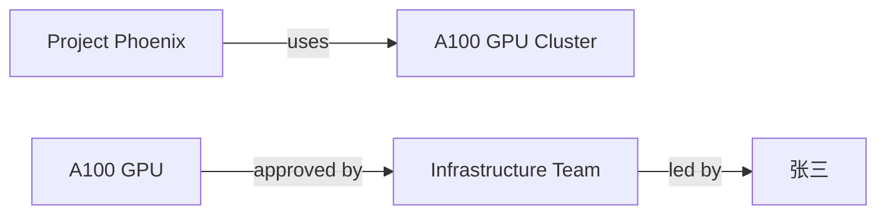
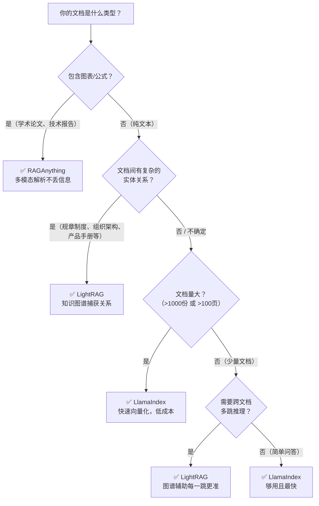

# DeepTutor 三种 RAG 模式对比：用例子说话

## 一、三种模式一览

DeepTutor 支持三种 RAG 管线，各有侧重：

| 模式            | 核心技术                     | 一句话总结                               |
| --------------- | ---------------------------- | ---------------------------------------- |
| **LightRAG**    | 知识图谱 + 向量检索          | 纯文本文档的最佳选择，自动提取实体关系   |
| **RAGAnything** | MinerU 多模态解析 + LightRAG | 学术论文/带图表公式的 PDF 首选           |
| **LlamaIndex**  | 纯向量检索                   | 速度最快，适合简单场景或海量文档快速入库 |

---

## 二、例子 1：企业知识问答（纯文本 + 多跳推理）

### 📋 场景

三份 TXT 文件：

| 文件         | 内容                                                                  |
| ------------ | --------------------------------------------------------------------- |
| 员工手册.txt | "所有使用 NVIDIA A100 GPU 的项目，必须由**基础设施团队**审批。"       |
| 项目列表.txt | "**项目 Phoenix** 使用了 NVIDIA A100 GPU 集群进行大模型训练。"        |
| 组织架构.txt | "**基础设施团队**的负责人是**张三**，联系邮箱 zhangsan@company.com。" |

**问题：** "项目 Phoenix 的 GPU 资源审批应该找谁？"

这个问题需要**跨 3 份文档推理**：Phoenix → A100 GPU → 基础设施团队审批 → 张三。

### 🔍 三种模式的表现

#### LightRAG 模式 ⭐ 推荐

**构建阶段：** 调用 LLM 提取实体和关系，构建知识图谱：



**检索特点：**

- `hybrid` 模式三管齐下（图遍历 + 社区摘要 + 向量匹配）
- 即使 LLM 把 "A100 GPU" 和 "A100 GPU Cluster" 拆成两个实体，向量匹配也能兜底
- 第 1 轮检索就能拿到"Phoenix 用 A100 → 需要基础设施团队审批"

**评价：** ✅ 检索质量高，关系理解准确，2 轮迭代即可完成

#### RAGAnything 模式

**构建阶段：** 先用 MinerU 解析文件 → 然后走和 LightRAG 一样的知识图谱流程。

**问题：** TXT 文件里没有图片、表格、公式，MinerU 解析阶段**纯属浪费时间**。最终的知识图谱和检索结果与 LightRAG 基本一致。

**评价：** ✅ 效果一样，但构建速度慢了一截（杀鸡用牛刀）

#### LlamaIndex 模式

**构建阶段：** 直接对文本做向量嵌入，不提取实体，不建图谱。速度最快。

**检索特点：**

- 查询 "项目 Phoenix GPU 资源" → 向量匹配
- 项目列表.txt（提到 Phoenix + GPU）→ ✅ 高相似度，命中
- 员工手册.txt（提到 A100 GPU + 审批）→ ✅ 中等相似度，大概率命中
- 组织架构.txt（提到张三）→ ❌ 第 1 轮大概率不命中（与 Phoenix/GPU 无语义关联）

**评价：** ✅ 最终也能答对（靠 Agent 第 2 轮追问弥补），但单次检索精度不如 LightRAG

### 📊 本例对比

| 维度                  | LightRAG          | RAGAnything | LlamaIndex        |
| --------------------- | ----------------- | ----------- | ----------------- |
| 最终答对              | ✅                | ✅          | ✅                |
| 构建速度              | 中等 (~15s)       | 慢 (~30s)   | **快 (~3s)**      |
| 第 1 轮检索信息完整度 | ⭐⭐⭐⭐⭐        | ⭐⭐⭐⭐⭐  | ⭐⭐⭐            |
| 理解实体关系          | ✅ 知道"谁审批谁" | ✅ 同左     | ❌ 只知道文本相似 |
| 本场景推荐            | ⭐⭐⭐⭐⭐        | ⭐⭐⭐      | ⭐⭐⭐⭐          |

> **结论：** 纯文本 + 多跳推理场景 → **首选 LightRAG**。LlamaIndex 虽然构建快，但检索精度略低。RAGAnything 没必要。

---

## 三、例子 2：学术论文问答（PDF + 图表 + 公式）

### 📋 场景

一份机器学习论文 `transformer.pdf`，包含：

- 文字描述 50+ 页
- 模型架构图（Figure 1: Transformer Architecture）
- 性能对比表格（Table 2: BLEU Scores）
- 数学公式（Attention(Q,K,V) = softmax(QK^T/√d_k)V）

**问题：** "Transformer 的注意力机制中，缩放因子 √d_k 的作用是什么？Table 2 中哪个模型 BLEU 分数最高？"

这个问题需要：① 理解公式中的符号含义，② 读懂表格数据。

### 🔍 三种模式的表现

#### RAGAnything 模式 ⭐ 推荐

**构建阶段：**

1. **MinerU 解析** → 自动识别出文字、图片、表格、公式
2. 图片提取为独立文件，表格转为结构化数据，公式转为 LaTeX
3. 所有内容（包括图片描述、表格数据）送入 LightRAG 建图

**检索特点：**

- 查询公式含义 → 关联到公式所在段落的上下文解释
- 查询表格数据 → 结构化表格已被解析，可以准确回答 "哪个最高"
- 图片（如架构图）被解析为文字描述，也可被检索

**评价：** ✅ 唯一能**完整理解图、表、公式**的模式

#### LightRAG 模式

**构建阶段：** PDFParser 提取 PDF 中的纯文本（跳过图片和复杂布局）。

**检索特点：**

- 文字描述部分 → ✅ 没问题，能解释 √d_k 的作用
- 表格数据 → ⚠️ 取决于 PDF 解析质量；简单表格可能提取到文字，复杂表格可能丢失结构
- 公式 → ⚠️ 纯文本提取的公式可能变成乱码（如 `softmax(QKTdk)V`）
- 图片 → ❌ 完全无法处理

**评价：** ⚠️ 能回答文字部分，但图表公式信息可能丢失

#### LlamaIndex 模式

**构建阶段：** SimpleDirectoryReader 读取 PDF 文本，向量化。

**检索特点：** 与 LightRAG 类似，只能处理提取出的纯文本。

**评价：** ⚠️ 同 LightRAG 的局限，且没有知识图谱辅助

### 📊 本例对比

| 维度       | LightRAG    | RAGAnything           | LlamaIndex  |
| ---------- | ----------- | --------------------- | ----------- |
| 文字理解   | ✅          | ✅                    | ✅          |
| 表格数据   | ⚠️ 部分     | ✅ 结构化解析         | ⚠️ 部分     |
| 数学公式   | ⚠️ 可能乱码 | ✅ LaTeX 解析         | ⚠️ 可能乱码 |
| 图片内容   | ❌          | ✅ 描述提取           | ❌          |
| 构建速度   | 中等        | **慢**（MinerU 解析） | 快          |
| 本场景推荐 | ⭐⭐⭐      | ⭐⭐⭐⭐⭐            | ⭐⭐        |

> **结论：** 学术论文/带图表公式的 PDF → **必须用 RAGAnything**。这正是它存在的意义。

---

## 四、例子 3：客服日志快速检索（海量短文本 + 简单问题）

### 📋 场景

10000 条客服对话记录 `support_logs.txt`（每条 2-3 行），如：

```
[2024-01-15] 用户：我的订单 #12345 物流状态是什么？客服：已发货，预计1月18日到达。
[2024-01-15] 用户：如何退换商品？客服：请在收货后7天内在"我的订单"中申请退换...
[2024-01-16] 用户：VIP 会员有什么优惠？客服：VIP 会员享受9折优惠和免运费...
... (10000条)
```

**问题：** "VIP 会员的退换货政策和普通用户有什么区别？"

这是一个简单的检索问题，不需要复杂推理，只需要找到相关记录。

### 🔍 三种模式的表现

#### LlamaIndex 模式 ⭐ 推荐

**构建阶段：** 直接分块 + 向量化。10000 条记录处理速度快。

**检索特点：**

- 向量匹配到"VIP 会员"相关记录 ✅
- 向量匹配到"退换货"相关记录 ✅
- 两者交集就是答案

**评价：** ✅ 快速高效，这种场景不需要知识图谱

#### LightRAG 模式

**构建阶段：** 对 10000 条记录提取实体和关系…

**问题：**

- LLM 需要处理每个 chunk，10000 条 → 大量 LLM 调用 → **成本和时间极高**
- 客服日志中的"实体"多为订单号、日期等临时信息，建知识图谱**意义不大**
- 图谱会变得非常庞杂，反而降低检索效率

**评价：** ❌ 大材小用，构建成本太高，收益不明显

#### RAGAnything 模式

**构建阶段：** 纯文本走 MinerU → LightRAG，与 LightRAG 相同但更慢。

**评价：** ❌ 纯文本不需要多模态解析，且有 LightRAG 的同样问题

### 📊 本例对比

| 维度               | LightRAG       | RAGAnything | LlamaIndex       |
| ------------------ | -------------- | ----------- | ---------------- |
| 构建速度 (10000条) | 慢（数小时）   | 更慢        | **快（分钟级）** |
| LLM 调用成本       | 高（实体提取） | 高          | **低（仅嵌入）** |
| 检索质量           | ✅             | ✅          | ✅               |
| 本场景推荐         | ⭐⭐           | ⭐          | ⭐⭐⭐⭐⭐       |

> **结论：** 海量短文本 + 简单检索 → **首选 LlamaIndex**。不需要知识图谱，向量搜索足矣。

---

## 五、模式选择决策树



## 六、速查推荐表

| 场景                       | 推荐模式        | 理由                           |
| -------------------------- | --------------- | ------------------------------ |
| 学术论文（PDF + 图表公式） | **RAGAnything** | 唯一能处理多模态内容           |
| 企业规章制度 + 组织架构    | **LightRAG**    | 知识图谱捕获"谁管谁、谁审批谁" |
| 产品文档 + 技术规范        | **LightRAG**    | 产品间的依赖/兼容关系需要图谱  |
| 法律合同/条款              | **LightRAG**    | 条款间的引用和约束关系复杂     |
| 客服日志/FAQ               | **LlamaIndex**  | 简单检索，不需要关系图         |
| 新闻/博客文章              | **LlamaIndex**  | 文档间关联弱，向量搜索足够     |
| 代码文档/API 手册          | **LlamaIndex**  | 查函数/参数用向量匹配          |
| 教材/课本（含图表）        | **RAGAnything** | 需要理解图表和公式             |
| 少量文档快速上手           | **LlamaIndex**  | 速度最快，零等待               |
| 不确定 / 通用              | **LightRAG**    | 综合性能最均衡（默认选项）     |

## 七、核心总结

> **选择 RAG 模式的本质是在 "构建成本" 和 "检索精度" 之间找平衡。**

```
            检索精度
              ↑
              │    ┌─────────────┐
              │    │ RAGAnything │  (最全，但最慢)
              │    └──────┬──────┘
              │           │
              │    ┌──────┴──────┐
              │    │  LightRAG   │  (均衡之选)
              │    └──────┬──────┘
              │           │
              │    ┌──────┴──────┐
              │    │  LlamaIndex │  (最快，但纯向量)
              │    └─────────────┘
              └──────────────────→ 构建速度
```

但别忘了最重要的一点——**真正让 DeepTutor 能回答多跳问题的，不是某种 RAG 模式，而是 Agent 的分析循环**。RAG 模式只决定"每一跳检索的质量"，Agent 循环决定"要跳几次、往哪里跳"。即使用最简单的 LlamaIndex，Agent 也能通过多轮迭代弥补检索精度的不足。
