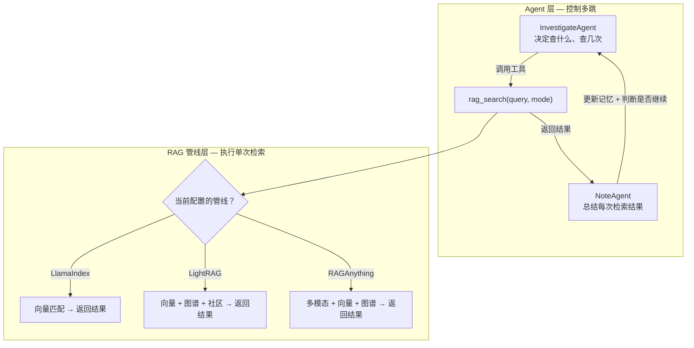
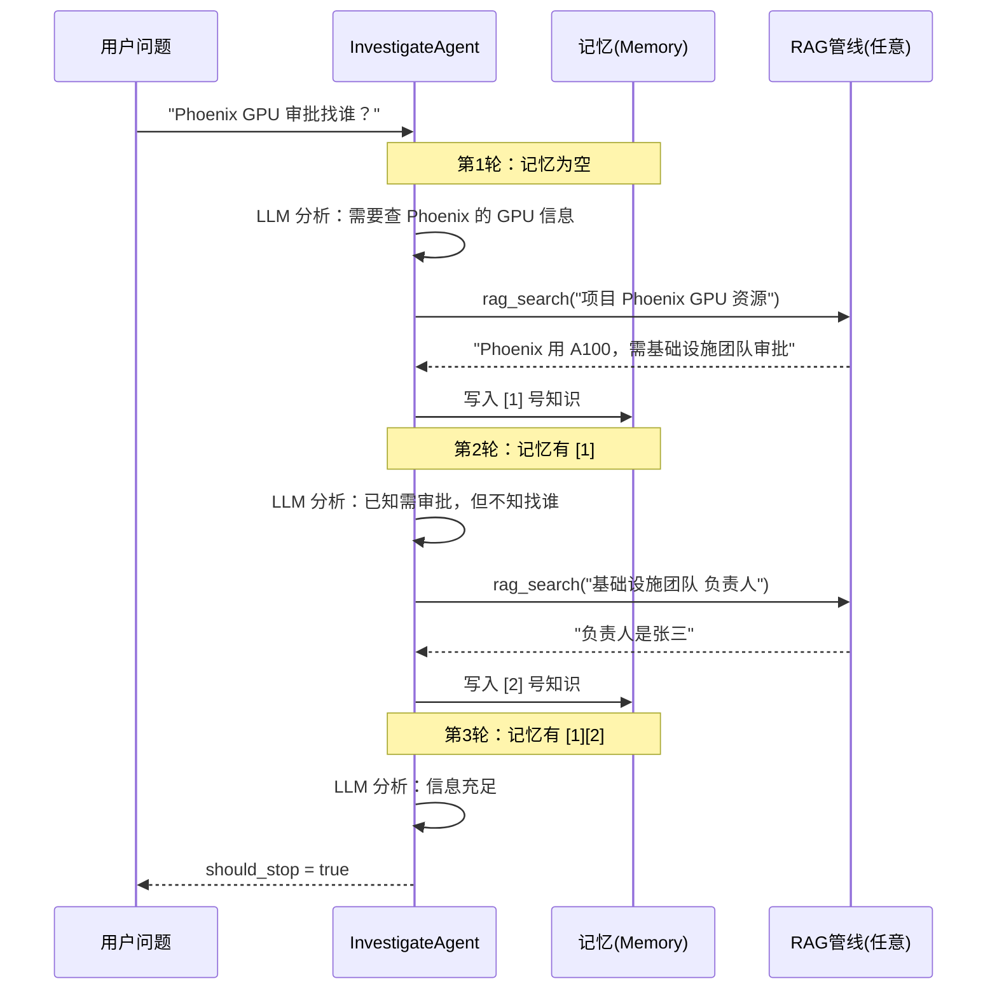

# 多跳推理的 Agent 实现原理

## 核心结论：多跳推理在 Agent 层，不在 RAG 层

```
┌─────────────────────────────────────────────────────────┐
│  Agent 层 (决定"查几次、查什么")  ← 多跳推理的核心      │
│  ┌──────────────────────────────────────────────────┐   │
│  │  InvestigateAgent 循环                            │   │
│  │  第1轮: 分析问题 → 生成查询 → 调用工具 → 记录知识 │   │
│  │  第2轮: 发现不够 → 新查询 → 调用工具 → 记录知识   │   │
│  │  第N轮: 信息充足 → 停止                           │   │
│  └──────────────────────────────────────────────────┘   │
│                        ↕ 只需要一个接口: rag_search()    │
├─────────────────────────────────────────────────────────┤
│  RAG 管线层 (决定"每次查得多准")                         │
│  LlamaIndex: 向量匹配                                   │
│  LightRAG:   向量 + 图谱 + 社区                         │
│  RAGAnything: 多模态 + 向量 + 图谱                      │
└─────────────────────────────────────────────────────────┘
```

**LlamaIndex 是最简单的管线（纯向量匹配），但系统照样能完成多跳推理**——这证明了多跳推理能力来自 Agent 循环，而非 RAG 管线。

RAG 管线的作用是提升"每一跳"的质量（LightRAG 的图谱让单次检索更准），Agent 循环决定"要不要继续跳、往哪跳"。两者解耦，管线可替换。

---

## 架构解耦设计



**Agent 不关心底层用的是哪种 RAG 管线**——它只需要调用 `rag_search(query)` 得到一段相关文本。管线内部是向量匹配还是图谱遍历，Agent 完全不感知。

---

## InvestigateAgent 循环：多跳的核心机制

### 关键文件

- 主控器: [main_solver.py](file:///c:/D/work/zs/DeepTutor/src/agents/solve/main_solver.py) — `_run_dual_loop_pipeline()` 方法
- 调查员: [investigate_agent.py](file:///c:/D/work/zs/DeepTutor/src/agents/solve/analysis_loop/investigate_agent.py) — `process()` 方法
- 笔记员: [note_agent.py](file:///c:/D/work/zs/DeepTutor/src/agents/solve/analysis_loop/note_agent.py) — `process()` 方法
- 记忆: [investigate_memory.py](file:///c:/D/work/zs/DeepTutor/src/agents/solve/memory/investigate_memory.py) — `InvestigateMemory` 类

### 循环伪代码

```python
# MainSolver._run_dual_loop_pipeline() 中的分析循环核心逻辑

for i in range(max_iterations):  # 默认最多 5 轮

    # ① InvestigateAgent: 基于"已有知识 + 原始问题"，决定下一步做什么
    result = await investigate_agent.process(
        question=question,       # 用户原始问题
        memory=memory,           # 已有的知识链（前几轮积累的）
    )

    # ② 执行工具调用（RAG检索 / Web搜索 / 查询编号条目）
    # InvestigateAgent 内部已经执行了工具调用，结果存入 memory

    # ③ NoteAgent: 对新获取的知识生成摘要
    await note_agent.process(
        question=question,
        memory=memory,
        new_knowledge_ids=result["knowledge_item_ids"],
    )

    # ④ 判断是否停止
    if result["should_stop"]:
        break  # 信息充足，进入求解循环
```

### 每一轮 InvestigateAgent 做了什么

InvestigateAgent 接收的"提示词"大致包含：

```
你是一个调查员。用户问了这个问题：{question}

你已经知道的信息：
[1] Phoenix 用 A100 GPU 集群，需基础设施团队审批
（如果是第1轮，这里为空）

你还有哪些问题没回答？
- 基础设施团队的负责人是谁？

请决定下一步：
- 使用 rag_hybrid 检索更多信息
- 使用 rag_naive 做简单检索
- 使用 web_search 搜索网络
- 使用 query_item 查编号条目
- 使用 none 表示信息已充足
```

LLM 返回 JSON 格式的查询计划：

```json
{
  "reasoning": "已知需要基础设施团队审批，但不知负责人。需要查询。",
  "plan": [{ "tool": "rag_hybrid", "query": "基础设施团队 负责人 联系方式" }]
}
```

### 多跳推理的本质：记忆驱动的迭代决策



**每一轮的输入都包含之前所有轮次积累的知识**，这就是"记忆驱动"——LLM 能看到"我已经知道什么"，从而决定"还需要查什么"。

---

## 为什么不直接把用户问题丢给 RAG？

传统 RAG 的做法：

```
用户问题 → 向量化 → 检索一次 → LLM 生成答案 → 结束
```

DeepTutor 的做法：

```
用户问题 → Agent 分析 → 检索 → 记录 → 够了吗？
                ↑                          │
                └── 不够，换个角度再查 ←──┘
```

| 维度       | 传统 RAG  | DeepTutor Agent 多跳 |
| ---------- | --------- | -------------------- |
| 检索次数   | 固定 1 次 | 动态 1~N 次          |
| 查询来源   | 用户原话  | LLM 生成的精准查询   |
| 查询策略   | 无        | 基于已有知识动态调整 |
| 信息完整性 | 碰运气    | 主动追问补全         |
| 跨文档推理 | ❌ 无法   | ✅ 迭代串联          |

---

## 关键设计要素（后续深入学习方向）

### 1. InvestigateAgent 的 Prompt 工程

Agent 的推理能力完全依赖 Prompt 设计。关键要素：

- 如何将"已有知识链"格式化给 LLM
- 如何引导 LLM 判断"信息是否充足"
- 如何让 LLM 生成结构化的查询计划（JSON 格式）
- **学习入口：** [investigate_agent.py](file:///c:/D/work/zs/DeepTutor/src/agents/solve/analysis_loop/investigate_agent.py) 中的 prompt 构建逻辑

### 2. 记忆系统的设计

记忆是多跳推理的状态载体：

- `InvestigateMemory.knowledge_chain` — 按顺序存储每一跳的知识
- `CitationMemory` — 追踪每条知识的来源，供结果生成阶段引用
- **学习入口：** [investigate_memory.py](file:///c:/D/work/zs/DeepTutor/src/agents/solve/memory/investigate_memory.py)

### 3. 停止条件的判断

什么时候停止检索？两种机制：

- **LLM 主动判断：** InvestigateAgent 输出 `tool: "none"` 表示信息充足
- **硬上限：** `max_iterations` 配置（默认 5 轮）防止无限循环
- **学习入口：** [main_solver.py](file:///c:/D/work/zs/DeepTutor/src/agents/solve/main_solver.py) 中的循环控制逻辑

### 4. 求解循环（分析循环之后）

分析循环收集完知识后，求解循环负责结构化生成答案：

- `ManagerAgent` — 拆解回答步骤
- `SolveAgent` — 评估每步材料是否充足
- `ToolAgent` — 按需补充检索
- `ResponseAgent` — 生成每步的回答
- **学习入口：** [manager_agent.py](file:///c:/D/work/zs/DeepTutor/src/agents/solve/solve_loop/manager_agent.py)

### 5. Agent 与 RAG 的解耦接口

Agent 通过统一的工具接口调用 RAG，不感知底层实现：

- `rag_search(query, kb_name, mode)` — 统一的检索入口
- 底层可以是 LlamaIndex / LightRAG / RAGAnything 任意一种
- **学习入口：** [rag_tool.py](file:///c:/D/work/zs/DeepTutor/src/tools/rag_tool.py)

---

## 一句话总结

> **多跳推理 = InvestigateAgent 的"分析→检索→记录→够了吗？"循环。RAG 管线只是这个循环中调用的一个工具。换掉管线不影响多跳能力，换掉 Agent 循环则多跳能力直接消失。**
